# [📈 Live Status](https://upptime.github.io/upptime): <!--live status--> **🟧 Partial outage**

This repository contains the open-source uptime monitor and status page for [Upptime](https://upptime.js.org), powered by [Upptime](https://github.com/upptime/upptime).

With [Upptime](https://upptime.js.org), you can get your own unlimited and free uptime monitor and status page, powered entirely by a GitHub repository. We use [Issues](https://github.com/upptime/upptime/issues) as incident reports, [Actions](https://github.com/bvenkysubbu/tymlymonitor/actions) as uptime monitors, and [Pages](https://upptime.github.io/upptime) for the status page.

<!--start: status pages-->
<!-- This summary is generated by Upptime (https://github.com/upptime/upptime) -->
<!-- Do not edit this manually, your changes will be overwritten -->
<!-- prettier-ignore -->
| URL | Status | History | Response Time | Uptime |
| --- | ------ | ------- | ------------- | ------ |
|  [Trifecta Esplanade](https://cloud.tymly.in/status/1003) | 🟩 Up | [trifecta-esplanade.yml](https://github.com/bvenkysubbu/tymlymonitor/commits/HEAD/history/trifecta-esplanade.yml) | 

 2935ms
     
 | 

<a href="https://bvenkysubbu.github.io/tymlymonitor/history/trifecta-esplanade">85.81%</a>
    

|  [Casa Gopalan Block B Lift](https://cloud.tymly.in/status/1005) | 🟩 Up | [casa-gopalan-block-b-lift.yml](https://github.com/bvenkysubbu/tymlymonitor/commits/HEAD/history/casa-gopalan-block-b-lift.yml) | 

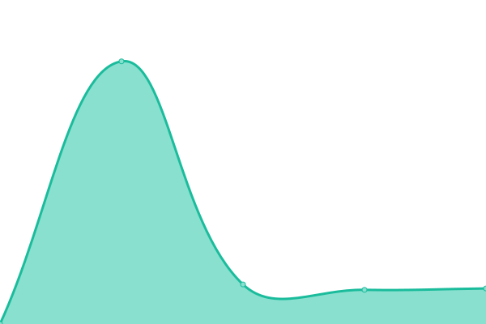 2575ms
     
 | 

<a href="https://bvenkysubbu.github.io/tymlymonitor/history/casa-gopalan-block-b-lift">100.00%</a>
    

|  [Casa Gopalan Block A Lift](https://cloud.tymly.in/status/1006) | 🟩 Up | [casa-gopalan-block-a-lift.yml](https://github.com/bvenkysubbu/tymlymonitor/commits/HEAD/history/casa-gopalan-block-a-lift.yml) | 

 2806ms
     
 | 

<a href="https://bvenkysubbu.github.io/tymlymonitor/history/casa-gopalan-block-a-lift">100.00%</a>
    

|  [Gayathri Goodlife](https://cloud.tymly.in/status/1009) | 🟩 Up | [gayathri-goodlife.yml](https://github.com/bvenkysubbu/tymlymonitor/commits/HEAD/history/gayathri-goodlife.yml) | 

 6718ms
     
 | 

<a href="https://bvenkysubbu.github.io/tymlymonitor/history/gayathri-goodlife">99.01%</a>
    

|  [Amrutha Value](https://cloud.tymly.in/status/1010) | 🟩 Up | [amrutha-value.yml](https://github.com/bvenkysubbu/tymlymonitor/commits/HEAD/history/amrutha-value.yml) | 

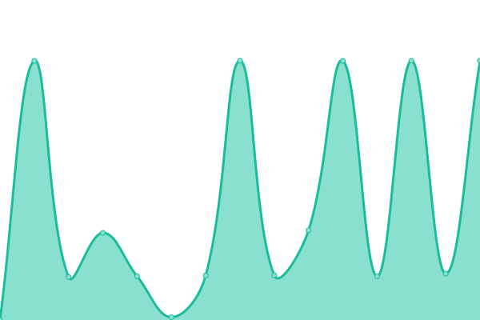 6398ms
     
 | 

<a href="https://bvenkysubbu.github.io/tymlymonitor/history/amrutha-value">75.35%</a>
    

|  [Sterling Shalom C Block](https://cloud.tymly.in/status/1011) | 🟩 Up | [sterling-shalom-c-block.yml](https://github.com/bvenkysubbu/tymlymonitor/commits/HEAD/history/sterling-shalom-c-block.yml) | 

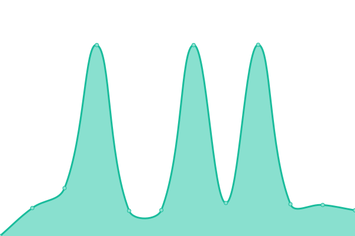 2786ms
     
 | 

<a href="https://bvenkysubbu.github.io/tymlymonitor/history/sterling-shalom-c-block">100.00%</a>
    

|  [Sterling Shalom D Block](https://cloud.tymly.in/status/1012) | 🟩 Up | [sterling-shalom-d-block.yml](https://github.com/bvenkysubbu/tymlymonitor/commits/HEAD/history/sterling-shalom-d-block.yml) | 

 2703ms
     
 | 

<a href="https://bvenkysubbu.github.io/tymlymonitor/history/sterling-shalom-d-block">100.00%</a>
    

|  [Sterling Shalom F Block](https://cloud.tymly.in/status/1013) | 🟩 Up | [sterling-shalom-f-block.yml](https://github.com/bvenkysubbu/tymlymonitor/commits/HEAD/history/sterling-shalom-f-block.yml) | 

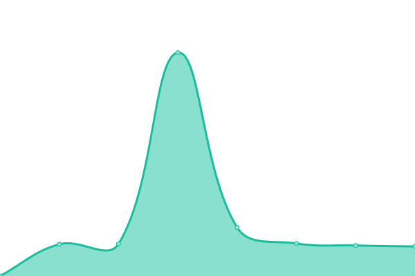 2859ms
     
 | 

<a href="https://bvenkysubbu.github.io/tymlymonitor/history/sterling-shalom-f-block">100.00%</a>
    

|  [Sai Raghavendras Bloomfields](https://cloud.tymly.in/status/1014) | 🟩 Up | [sai-raghavendras-bloomfields.yml](https://github.com/bvenkysubbu/tymlymonitor/commits/HEAD/history/sai-raghavendras-bloomfields.yml) | 

 1311ms
     
 | 

<a href="https://bvenkysubbu.github.io/tymlymonitor/history/sai-raghavendras-bloomfields">67.60%</a>
    

|  [Amrutha Sarovar](https://cloud.tymly.in/status/1016) | 🟥 Down | [amrutha-sarovar.yml](https://github.com/bvenkysubbu/tymlymonitor/commits/HEAD/history/amrutha-sarovar.yml) | 

 469ms
     
 | 

<a href="https://bvenkysubbu.github.io/tymlymonitor/history/amrutha-sarovar">100.00%</a>
    

|  [Trifecta Esplanade Security](https://cloud.tymly.in/status/1017) | 🟥 Down | [trifecta-esplanade-security.yml](https://github.com/bvenkysubbu/tymlymonitor/commits/HEAD/history/trifecta-esplanade-security.yml) | 

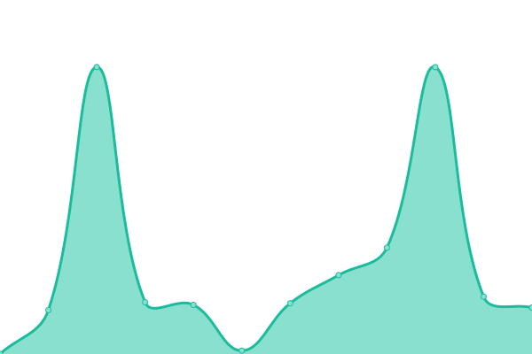 5178ms
     
 | 

<a href="https://bvenkysubbu.github.io/tymlymonitor/history/trifecta-esplanade-security">33.57%</a>
    

|  [SBB Touchstone Reborn](https://cloud.tymly.in/status/1018) | 🟩 Up | [sbb-touchstone-reborn.yml](https://github.com/bvenkysubbu/tymlymonitor/commits/HEAD/history/sbb-touchstone-reborn.yml) | 

 5086ms
     
 | 

<a href="https://bvenkysubbu.github.io/tymlymonitor/history/sbb-touchstone-reborn">61.71%</a>
    

|  [United Elysium](https://cloud.tymly.in/status/1019) | 🟩 Up | [united-elysium.yml](https://github.com/bvenkysubbu/tymlymonitor/commits/HEAD/history/united-elysium.yml) | 

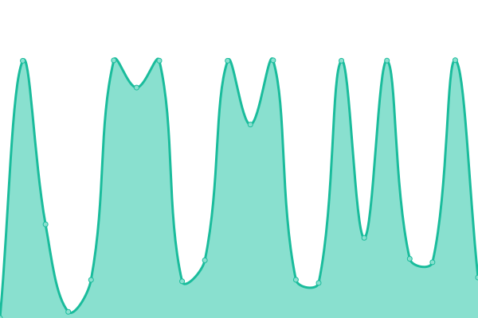 7654ms
     
 | 

<a href="https://bvenkysubbu.github.io/tymlymonitor/history/united-elysium">69.89%</a>
    

|  [Greenville Whitefield](https://cloud.tymly.in/status/1020) | 🟩 Up | [greenville-whitefield.yml](https://github.com/bvenkysubbu/tymlymonitor/commits/HEAD/history/greenville-whitefield.yml) | 

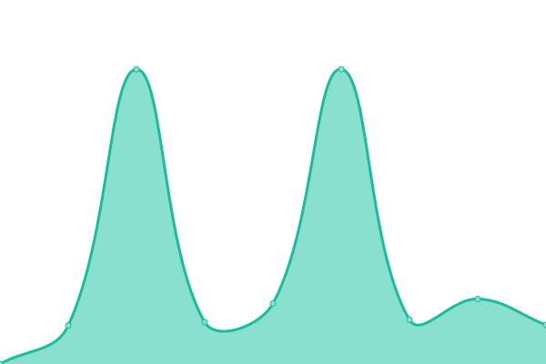 4410ms
     
 | 

<a href="https://bvenkysubbu.github.io/tymlymonitor/history/greenville-whitefield">99.80%</a>
    

|  [Sunshine Silicon Citi](https://cloud.tymly.in/status/1021) | 🟩 Up | [sunshine-silicon-citi.yml](https://github.com/bvenkysubbu/tymlymonitor/commits/HEAD/history/sunshine-silicon-citi.yml) | 

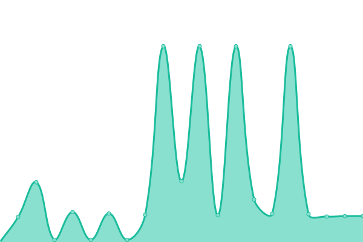 6054ms
     
 | 

<a href="https://bvenkysubbu.github.io/tymlymonitor/history/sunshine-silicon-citi">84.23%</a>
    

|  [Nitesh Forest Hills and Flush Meadows](https://cloud.tymly.in/status/1023) | 🟩 Up | [nitesh-forest-hills-and-flush-meadows.yml](https://github.com/bvenkysubbu/tymlymonitor/commits/HEAD/history/nitesh-forest-hills-and-flush-meadows.yml) | 

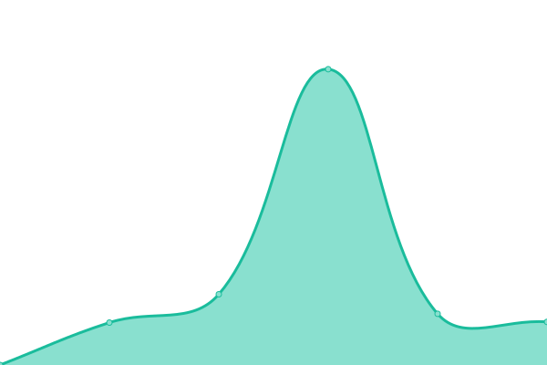 4221ms
     
 | 

<a href="https://bvenkysubbu.github.io/tymlymonitor/history/nitesh-forest-hills-and-flush-meadows">99.77%</a>
    

|  [Sterling Shalom A Block](https://cloud.tymly.in/status/1024) | 🟩 Up | [sterling-shalom-a-block.yml](https://github.com/bvenkysubbu/tymlymonitor/commits/HEAD/history/sterling-shalom-a-block.yml) | 

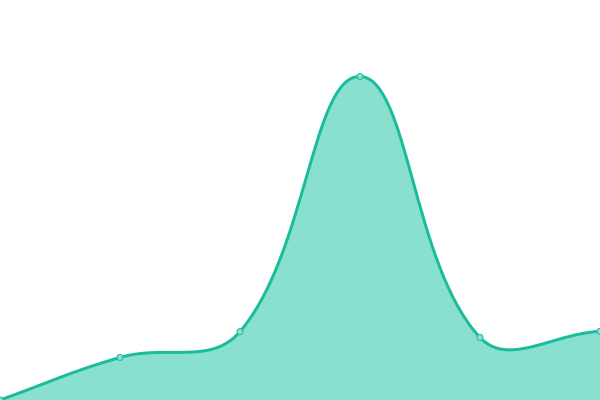 3116ms
     
 | 

<a href="https://bvenkysubbu.github.io/tymlymonitor/history/sterling-shalom-a-block">100.00%</a>
    

|  [DSR Sunrise Towers](https://cloud.tymly.in/status/1025) | 🟥 Down | [dsr-sunrise-towers.yml](https://github.com/bvenkysubbu/tymlymonitor/commits/HEAD/history/dsr-sunrise-towers.yml) | 

 229ms
     
 | 

<a href="https://bvenkysubbu.github.io/tymlymonitor/history/dsr-sunrise-towers">0.00%</a>
    

|  [United Elysium 2](https://cloud.tymly.in/status/1026) | 🟩 Up | [united-elysium-2.yml](https://github.com/bvenkysubbu/tymlymonitor/commits/HEAD/history/united-elysium-2.yml) | 

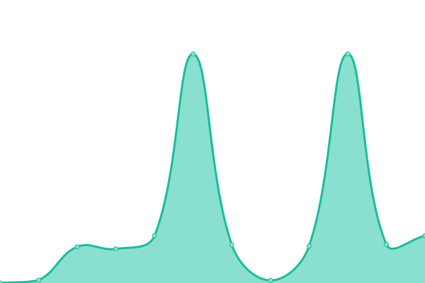 5515ms
     
 | 

<a href="https://bvenkysubbu.github.io/tymlymonitor/history/united-elysium-2">59.22%</a>
    

|  [DSR Sunrise Towers 2](https://cloud.tymly.in/status/1027) | 🟥 Down | [dsr-sunrise-towers-2.yml](https://github.com/bvenkysubbu/tymlymonitor/commits/HEAD/history/dsr-sunrise-towers-2.yml) | 

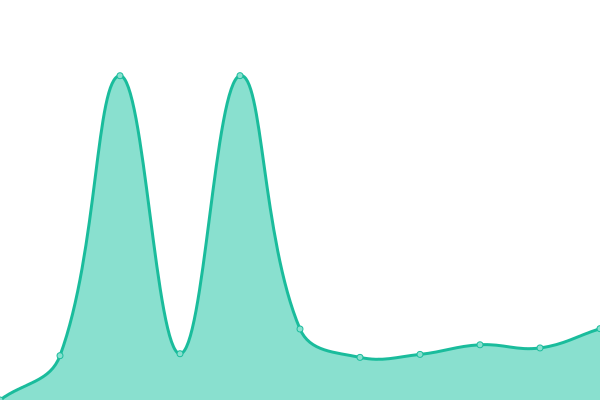 229ms
     
 | 

<a href="https://bvenkysubbu.github.io/tymlymonitor/history/dsr-sunrise-towers-2">0.00%</a>
    

|  [Adithya Pristine KMC](https://cloud.tymly.in/status/1028) | 🟥 Down | [adithya-pristine-kmc.yml](https://github.com/bvenkysubbu/tymlymonitor/commits/HEAD/history/adithya-pristine-kmc.yml) | 

 8870ms
     
 | 

<a href="https://bvenkysubbu.github.io/tymlymonitor/history/adithya-pristine-kmc">31.48%</a>
    

|  [Sraddha Whitecliff](https://cloud.tymly.in/status/1033) | 🟩 Up | [sraddha-whitecliff.yml](https://github.com/bvenkysubbu/tymlymonitor/commits/HEAD/history/sraddha-whitecliff.yml) | 

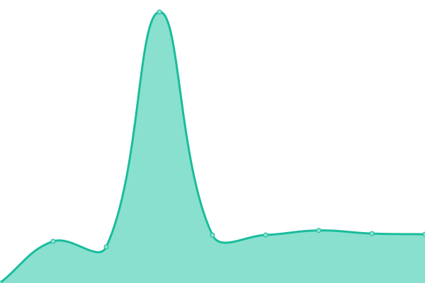 2938ms
     
 | 

<a href="https://bvenkysubbu.github.io/tymlymonitor/history/sraddha-whitecliff">100.00%</a>
    

|  [Sraddha Whitecliff 2](https://cloud.tymly.in/status/1034) | 🟩 Up | [sraddha-whitecliff-2.yml](https://github.com/bvenkysubbu/tymlymonitor/commits/HEAD/history/sraddha-whitecliff-2.yml) | 

 2084ms
     
 | 

<a href="https://bvenkysubbu.github.io/tymlymonitor/history/sraddha-whitecliff-2">87.70%</a>
    

|  [Sraddha Whitecliff 3](https://cloud.tymly.in/status/1035) | 🟩 Up | [sraddha-whitecliff-3.yml](https://github.com/bvenkysubbu/tymlymonitor/commits/HEAD/history/sraddha-whitecliff-3.yml) | 

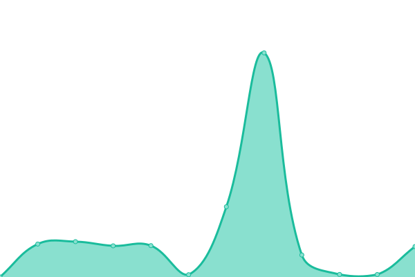 2030ms
     
 | 

<a href="https://bvenkysubbu.github.io/tymlymonitor/history/sraddha-whitecliff-3">92.98%</a>
    

|  [Sowparnika Ananda](https://cloud.tymly.in/status/1036) | 🟩 Up | [sowparnika-ananda.yml](https://github.com/bvenkysubbu/tymlymonitor/commits/HEAD/history/sowparnika-ananda.yml) | 

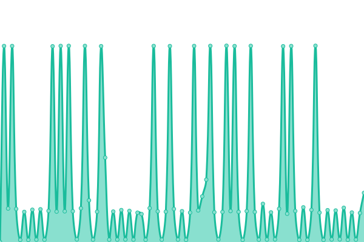 4187ms
     
 | 

<a href="https://bvenkysubbu.github.io/tymlymonitor/history/sowparnika-ananda">99.79%</a>
    

|  [Wilson Vintage 1](https://cloud.tymly.in/status/1037) | 🟩 Up | [wilson-vintage-1.yml](https://github.com/bvenkysubbu/tymlymonitor/commits/HEAD/history/wilson-vintage-1.yml) | 

 1633ms
     
 | 

<a href="https://bvenkysubbu.github.io/tymlymonitor/history/wilson-vintage-1">44.97%</a>
    

|  [Wilson Vintage 2](https://cloud.tymly.in/status/1038) | 🟩 Up | [wilson-vintage-2.yml](https://github.com/bvenkysubbu/tymlymonitor/commits/HEAD/history/wilson-vintage-2.yml) | 

 972ms
     
 | 

<a href="https://bvenkysubbu.github.io/tymlymonitor/history/wilson-vintage-2">44.97%</a>
    

|  [SNR Silver Ripples](https://cloud.tymly.in/status/1039) | 🟩 Up | [snr-silver-ripples.yml](https://github.com/bvenkysubbu/tymlymonitor/commits/HEAD/history/snr-silver-ripples.yml) | 

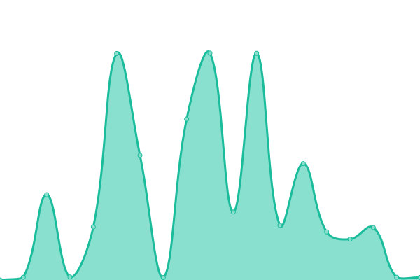 6692ms
     
 | 

<a href="https://bvenkysubbu.github.io/tymlymonitor/history/snr-silver-ripples">93.28%</a>
    

|  [SNR Silver Ripples 2](https://cloud.tymly.in/status/1040) | 🟩 Up | [snr-silver-ripples-2.yml](https://github.com/bvenkysubbu/tymlymonitor/commits/HEAD/history/snr-silver-ripples-2.yml) | 

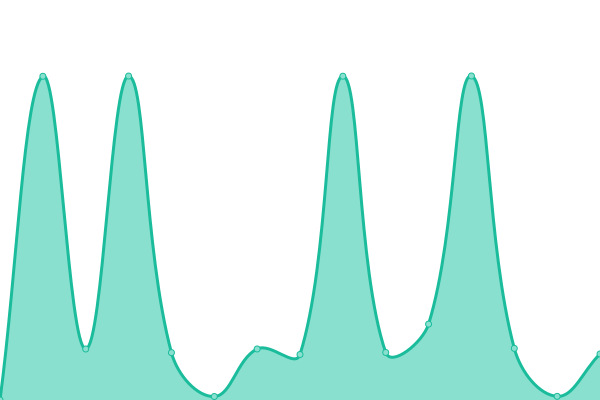 9641ms
     
 | 

<a href="https://bvenkysubbu.github.io/tymlymonitor/history/snr-silver-ripples-2">94.79%</a>
    

|  [Adarsh Vihar](https://cloud.tymly.in/status/1041) | 🟥 Down | [adarsh-vihar.yml](https://github.com/bvenkysubbu/tymlymonitor/commits/HEAD/history/adarsh-vihar.yml) | 

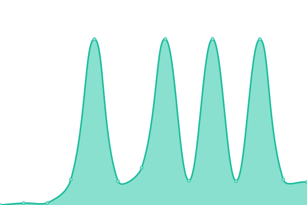 228ms
     
 | 

<a href="https://bvenkysubbu.github.io/tymlymonitor/history/adarsh-vihar">0.00%</a>
    

|  [Urban Greens](https://cloud.tymly.in/status/1046) | 🟩 Up | [urban-greens.yml](https://github.com/bvenkysubbu/tymlymonitor/commits/HEAD/history/urban-greens.yml) | 

 11530ms
     
 | 

<a href="https://bvenkysubbu.github.io/tymlymonitor/history/urban-greens">88.17%</a>
    

|  [Nitesh Flushing Meadows Block B](https://cloud.tymly.in/status/1047) | 🟩 Up | [nitesh-flushing-meadows-block-b.yml](https://github.com/bvenkysubbu/tymlymonitor/commits/HEAD/history/nitesh-flushing-meadows-block-b.yml) | 

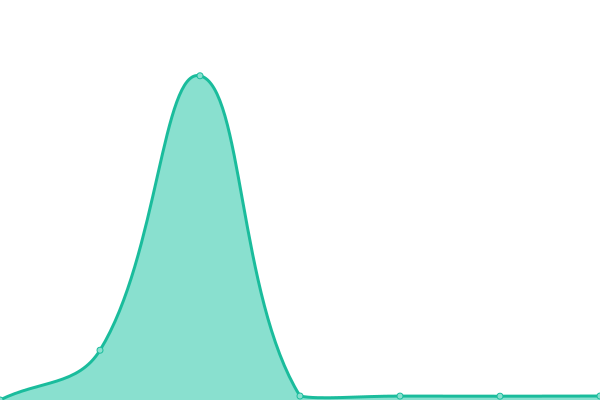 1892ms
     
 | 

<a href="https://bvenkysubbu.github.io/tymlymonitor/history/nitesh-flushing-meadows-block-b">98.88%</a>
    

|  [Ruchira Lilium v2](https://cloud.tymly.in/status/1048) | 🟩 Up | [ruchira-lilium-v2.yml](https://github.com/bvenkysubbu/tymlymonitor/commits/HEAD/history/ruchira-lilium-v2.yml) | 

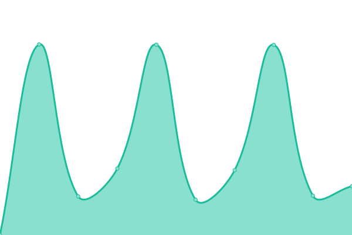 5033ms
     
 | 

<a href="https://bvenkysubbu.github.io/tymlymonitor/history/ruchira-lilium-v2">100.00%</a>
    

|  [Nitesh Flushing Meadows Block D](https://cloud.tymly.in/status/1049) | 🟩 Up | [nitesh-flushing-meadows-block-d.yml](https://github.com/bvenkysubbu/tymlymonitor/commits/HEAD/history/nitesh-flushing-meadows-block-d.yml) | 

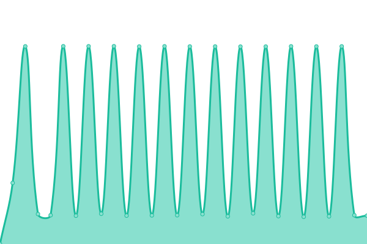 2550ms
     
 | 

<a href="https://bvenkysubbu.github.io/tymlymonitor/history/nitesh-flushing-meadows-block-d">93.63%</a>
    

|  [Nitesh Forest Hills Block C](https://cloud.tymly.in/status/1050) | 🟩 Up | [nitesh-forest-hills-block-c.yml](https://github.com/bvenkysubbu/tymlymonitor/commits/HEAD/history/nitesh-forest-hills-block-c.yml) | 

 6929ms
     
 | 

<a href="https://bvenkysubbu.github.io/tymlymonitor/history/nitesh-forest-hills-block-c">94.52%</a>
    

|  [Nitesh Forest Hills Block B](https://cloud.tymly.in/status/1051) | 🟩 Up | [nitesh-forest-hills-block-b.yml](https://github.com/bvenkysubbu/tymlymonitor/commits/HEAD/history/nitesh-forest-hills-block-b.yml) | 

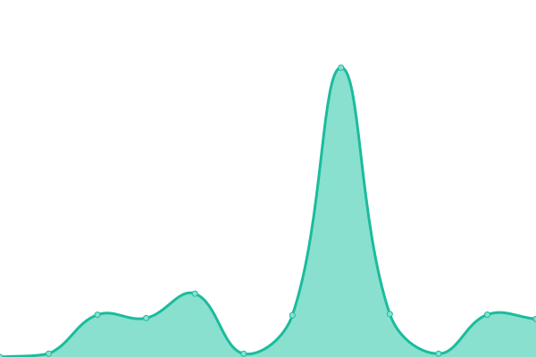 3690ms
     
 | 

<a href="https://bvenkysubbu.github.io/tymlymonitor/history/nitesh-forest-hills-block-b">94.98%</a>
    

|  [Nitesh Forest Hills Block A](https://cloud.tymly.in/status/1052) | 🟩 Up | [nitesh-forest-hills-block-a.yml](https://github.com/bvenkysubbu/tymlymonitor/commits/HEAD/history/nitesh-forest-hills-block-a.yml) | 

 3567ms
     
 | 

<a href="https://bvenkysubbu.github.io/tymlymonitor/history/nitesh-forest-hills-block-a">100.00%</a>
    

|  [Nitesh Flushing Meadows Block A](https://cloud.tymly.in/status/1053) | 🟩 Up | [nitesh-flushing-meadows-block-a.yml](https://github.com/bvenkysubbu/tymlymonitor/commits/HEAD/history/nitesh-flushing-meadows-block-a.yml) | 

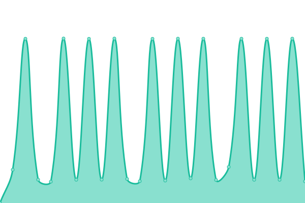 2680ms
     
 | 

<a href="https://bvenkysubbu.github.io/tymlymonitor/history/nitesh-flushing-meadows-block-a">99.18%</a>
    

|  [Nitesh Flushing Meadows Block C](https://cloud.tymly.in/status/1054) | 🟩 Up | [nitesh-flushing-meadows-block-c.yml](https://github.com/bvenkysubbu/tymlymonitor/commits/HEAD/history/nitesh-flushing-meadows-block-c.yml) | 

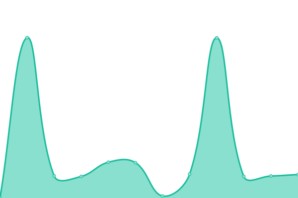 2699ms
     
 | 

<a href="https://bvenkysubbu.github.io/tymlymonitor/history/nitesh-flushing-meadows-block-c">99.18%</a>
    

|  [Sandeep Vihar Club House](https://cloud.tymly.in/status/1055) | 🟥 Down | [sandeep-vihar-club-house.yml](https://github.com/bvenkysubbu/tymlymonitor/commits/HEAD/history/sandeep-vihar-club-house.yml) | 

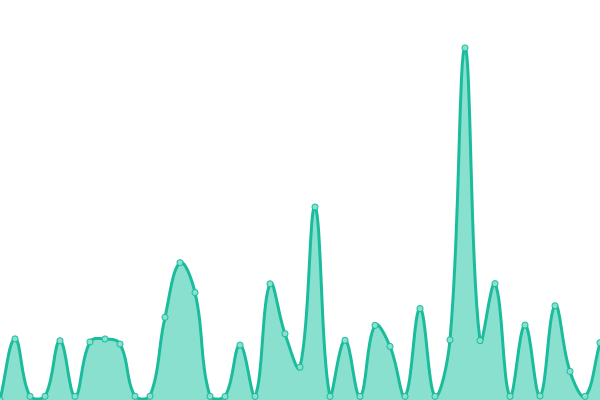 3223ms
     
 | 

<a href="https://bvenkysubbu.github.io/tymlymonitor/history/sandeep-vihar-club-house">56.52%</a>
    

|  [Prakruthi Villas Sarjapura](https://cloud.tymly.in/status/1058) | 🟩 Up | [prakruthi-villas-sarjapura.yml](https://github.com/bvenkysubbu/tymlymonitor/commits/HEAD/history/prakruthi-villas-sarjapura.yml) | 

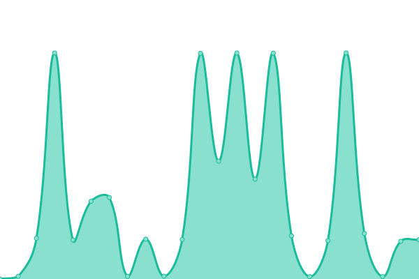 3607ms
     
 | 

<a href="https://bvenkysubbu.github.io/tymlymonitor/history/prakruthi-villas-sarjapura">95.65%</a>
    

|  [PSR Aster 1](https://cloud.tymly.in/status/1059) | 🟩 Up | [psr-aster-1.yml](https://github.com/bvenkysubbu/tymlymonitor/commits/HEAD/history/psr-aster-1.yml) | 

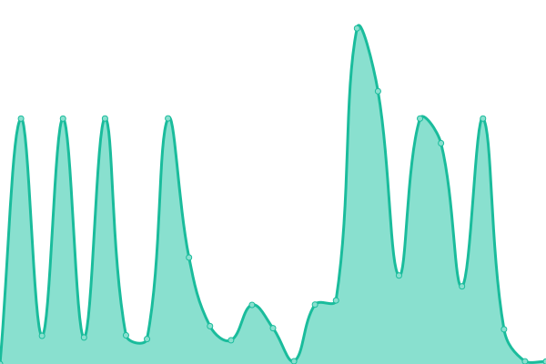 9130ms
     
 | 

<a href="https://bvenkysubbu.github.io/tymlymonitor/history/psr-aster-1">84.33%</a>
    

|  [PSR Aster 2 G Block](https://cloud.tymly.in/status/1060) | 🟩 Up | [psr-aster-2-g-block.yml](https://github.com/bvenkysubbu/tymlymonitor/commits/HEAD/history/psr-aster-2-g-block.yml) | 

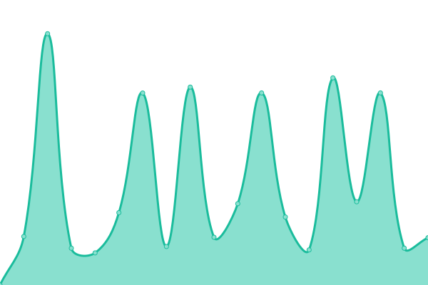 8736ms
     
 | 

<a href="https://bvenkysubbu.github.io/tymlymonitor/history/psr-aster-2-g-block">97.48%</a>
    

|  [Sowparnika Ananda D Block](https://cloud.tymly.in/status/1061) | 🟩 Up | [sowparnika-ananda-d-block.yml](https://github.com/bvenkysubbu/tymlymonitor/commits/HEAD/history/sowparnika-ananda-d-block.yml) | 

 3381ms
     
 | 

<a href="https://bvenkysubbu.github.io/tymlymonitor/history/sowparnika-ananda-d-block">100.00%</a>
    

|  [Balaji Sunflower](https://cloud.tymly.in/status/1062) | 🟩 Up | [balaji-sunflower.yml](https://github.com/bvenkysubbu/tymlymonitor/commits/HEAD/history/balaji-sunflower.yml) | 

 9069ms
     
 | 

<a href="https://bvenkysubbu.github.io/tymlymonitor/history/balaji-sunflower">93.65%</a>
    

|  [PSR Aster 3 E Block](https://cloud.tymly.in/status/1064) | 🟩 Up | [psr-aster-3-e-block.yml](https://github.com/bvenkysubbu/tymlymonitor/commits/HEAD/history/psr-aster-3-e-block.yml) | 

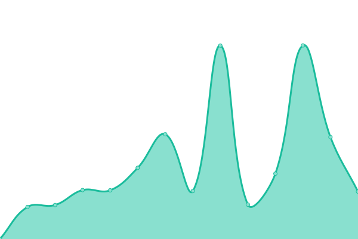 6818ms
     
 | 

<a href="https://bvenkysubbu.github.io/tymlymonitor/history/psr-aster-3-e-block">99.71%</a>
    

|  [PSR Aster 4 C Block](https://cloud.tymly.in/status/1065) | 🟩 Up | [psr-aster-4-c-block.yml](https://github.com/bvenkysubbu/tymlymonitor/commits/HEAD/history/psr-aster-4-c-block.yml) | 

 5505ms
     
 | 

<a href="https://bvenkysubbu.github.io/tymlymonitor/history/psr-aster-4-c-block">98.82%</a>
    

|  [Sai Gardens](https://cloud.tymly.in/status/1066) | 🟩 Up | [sai-gardens.yml](https://github.com/bvenkysubbu/tymlymonitor/commits/HEAD/history/sai-gardens.yml) | 

 3499ms
     
 | 

<a href="https://bvenkysubbu.github.io/tymlymonitor/history/sai-gardens">100.00%</a>
    

|  [Hinduja Park 1](https://cloud.tymly.in/status/1067) | 🟩 Up | [hinduja-park-1.yml](https://github.com/bvenkysubbu/tymlymonitor/commits/HEAD/history/hinduja-park-1.yml) | 

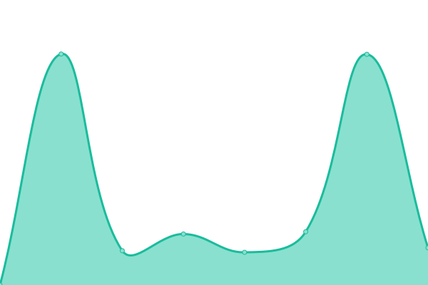 3047ms
     
 | 

<a href="https://bvenkysubbu.github.io/tymlymonitor/history/hinduja-park-1">87.22%</a>
    

|  [Sterling Villa Grande](https://cloud.tymly.in/status/1068) | 🟩 Up | [sterling-villa-grande.yml](https://github.com/bvenkysubbu/tymlymonitor/commits/HEAD/history/sterling-villa-grande.yml) | 

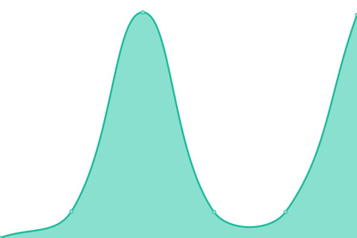 2868ms
     
 | 

<a href="https://bvenkysubbu.github.io/tymlymonitor/history/sterling-villa-grande">79.97%</a>
    

|  [Sterling Shalom B Block](https://cloud.tymly.in/status/1069) | 🟩 Up | [sterling-shalom-b-block.yml](https://github.com/bvenkysubbu/tymlymonitor/commits/HEAD/history/sterling-shalom-b-block.yml) | 

 2893ms
     
 | 

<a href="https://bvenkysubbu.github.io/tymlymonitor/history/sterling-shalom-b-block">99.78%</a>
    

|  [Sterling Shalom E Block](https://cloud.tymly.in/status/1070) | 🟩 Up | [sterling-shalom-e-block.yml](https://github.com/bvenkysubbu/tymlymonitor/commits/HEAD/history/sterling-shalom-e-block.yml) | 

 2827ms
     
 | 

<a href="https://bvenkysubbu.github.io/tymlymonitor/history/sterling-shalom-e-block">100.00%</a>
    

|  [Sai Gardens Community Hall](https://cloud.tymly.in/status/1073) | 🟩 Up | [sai-gardens-community-hall.yml](https://github.com/bvenkysubbu/tymlymonitor/commits/HEAD/history/sai-gardens-community-hall.yml) | 

 4573ms
     
 | 

<a href="https://bvenkysubbu.github.io/tymlymonitor/history/sai-gardens-community-hall">81.82%</a>
    

|  [Sai Gardens Temple Side](https://cloud.tymly.in/status/1074) | 🟩 Up | [sai-gardens-temple-side.yml](https://github.com/bvenkysubbu/tymlymonitor/commits/HEAD/history/sai-gardens-temple-side.yml) | 

 4324ms
     
 | 

<a href="https://bvenkysubbu.github.io/tymlymonitor/history/sai-gardens-temple-side">94.85%</a>
    

|  [Mahaveer Varna A1](https://cloud.tymly.in/status/1083) | 🟩 Up | [mahaveer-varna-a1.yml](https://github.com/bvenkysubbu/tymlymonitor/commits/HEAD/history/mahaveer-varna-a1.yml) | 

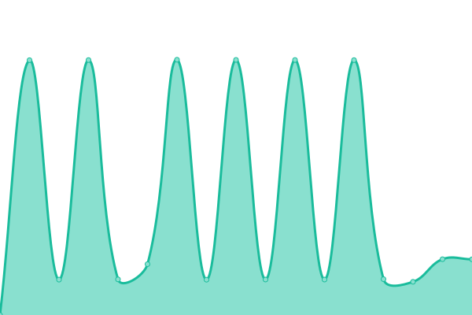 4525ms
     
 | 

<a href="https://bvenkysubbu.github.io/tymlymonitor/history/mahaveer-varna-a1">100.00%</a>
    

|  [Mahaveer Varna A4](https://cloud.tymly.in/status/1084) | 🟥 Down | [mahaveer-varna-a4.yml](https://github.com/bvenkysubbu/tymlymonitor/commits/HEAD/history/mahaveer-varna-a4.yml) | 

 229ms
     
 | 

<a href="https://bvenkysubbu.github.io/tymlymonitor/history/mahaveer-varna-a4">100.00%</a>
    

|  [Mahaveer Varna B1](https://cloud.tymly.in/status/1085) | 🟩 Up | [mahaveer-varna-b1.yml](https://github.com/bvenkysubbu/tymlymonitor/commits/HEAD/history/mahaveer-varna-b1.yml) | 

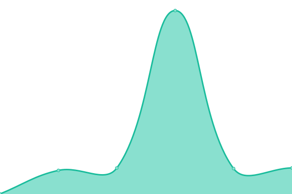 7322ms
     
 | 

<a href="https://bvenkysubbu.github.io/tymlymonitor/history/mahaveer-varna-b1">100.00%</a>
    

|  [Mahaveer Varna B3](https://cloud.tymly.in/status/1086) | 🟩 Up | [mahaveer-varna-b3.yml](https://github.com/bvenkysubbu/tymlymonitor/commits/HEAD/history/mahaveer-varna-b3.yml) | 

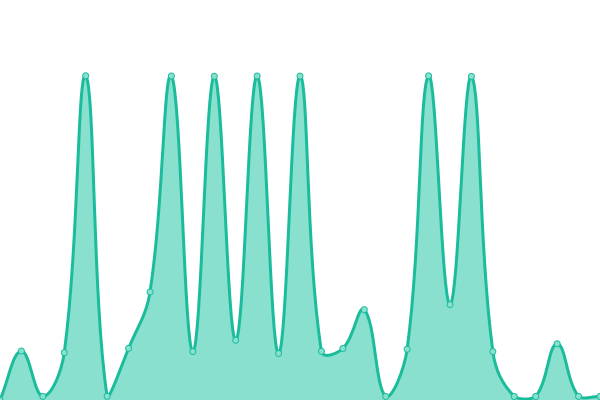 5573ms
     
 | 

<a href="https://bvenkysubbu.github.io/tymlymonitor/history/mahaveer-varna-b3">57.09%</a>
    

|  [Sumadhura Silver Ripples Club House](https://cloud.tymly.in/status/1090) | 🟩 Up | [sumadhura-silver-ripples-club-house.yml](https://github.com/bvenkysubbu/tymlymonitor/commits/HEAD/history/sumadhura-silver-ripples-club-house.yml) | 

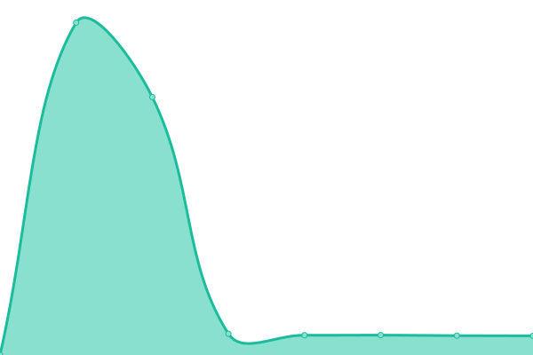 8193ms
     
 | 

<a href="https://bvenkysubbu.github.io/tymlymonitor/history/sumadhura-silver-ripples-club-house">96.03%</a>
    

|  [SMR Vinay Cascade B Block](https://cloud.tymly.in/status/1093) | 🟥 Down | [smr-vinay-cascade-b-block.yml](https://github.com/bvenkysubbu/tymlymonitor/commits/HEAD/history/smr-vinay-cascade-b-block.yml) | 

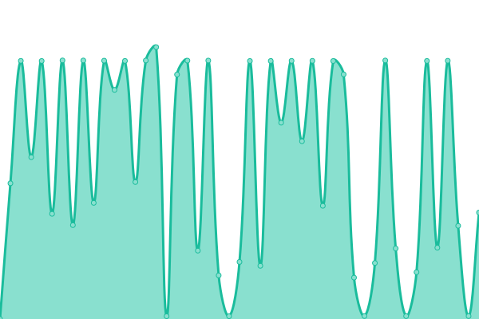 427ms
     
 | 

<a href="https://bvenkysubbu.github.io/tymlymonitor/history/smr-vinay-cascade-b-block">0.00%</a>
    

|  [SMR Vinay Cascade A Block](https://cloud.tymly.in/status/1094) | 🟥 Down | [smr-vinay-cascade-a-block.yml](https://github.com/bvenkysubbu/tymlymonitor/commits/HEAD/history/smr-vinay-cascade-a-block.yml) | 

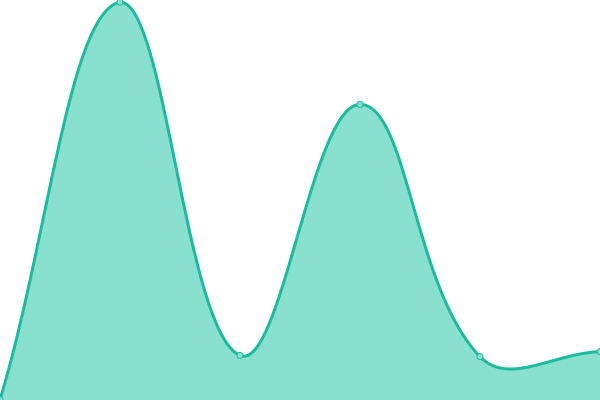 15870ms
     
 | 

<a href="https://bvenkysubbu.github.io/tymlymonitor/history/smr-vinay-cascade-a-block">87.84%</a>
    

|  [Whitestone Landmark](https://cloud.tymly.in/status/1095) | 🟥 Down | [whitestone-landmark.yml](https://github.com/bvenkysubbu/tymlymonitor/commits/HEAD/history/whitestone-landmark.yml) | 

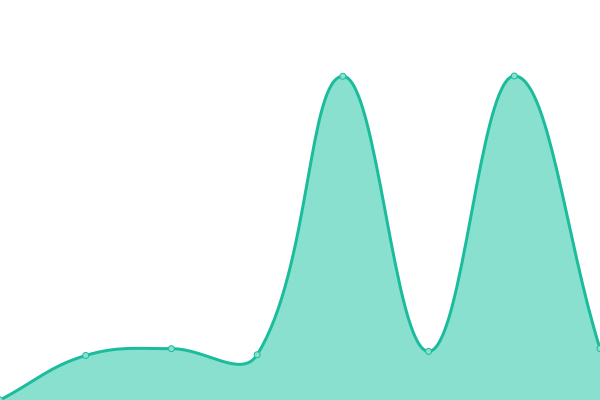 650ms
     
 | 

<a href="https://bvenkysubbu.github.io/tymlymonitor/history/whitestone-landmark">0.00%</a>
    

|  [White Breeze 1](https://cloud.tymly.in/status/1096) | 🟩 Up | [white-breeze-1.yml](https://github.com/bvenkysubbu/tymlymonitor/commits/HEAD/history/white-breeze-1.yml) | 

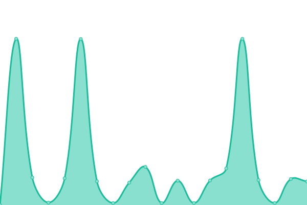 2092ms
     
 | 

<a href="https://bvenkysubbu.github.io/tymlymonitor/history/white-breeze-1">95.95%</a>
    

|  [White Breeze 2](https://cloud.tymly.in/status/1097) | 🟩 Up | [white-breeze-2.yml](https://github.com/bvenkysubbu/tymlymonitor/commits/HEAD/history/white-breeze-2.yml) | 

 2833ms
     
 | 

<a href="https://bvenkysubbu.github.io/tymlymonitor/history/white-breeze-2">95.94%</a>
    

|  [Sowparnika Swastika 2](https://cloud.tymly.in/status/1099) | 🟩 Up | [sowparnika-swastika-2.yml](https://github.com/bvenkysubbu/tymlymonitor/commits/HEAD/history/sowparnika-swastika-2.yml) | 

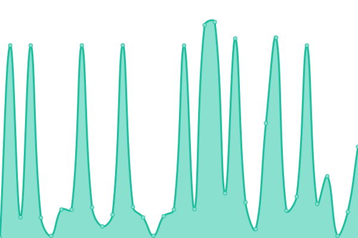 3304ms
     
 | 

<a href="https://bvenkysubbu.github.io/tymlymonitor/history/sowparnika-swastika-2">99.74%</a>
    

|  [Prestige Lakeside Habitat Tower 13](https://cloud.tymly.in/status/1100) | 🟩 Up | [prestige-lakeside-habitat-tower-13.yml](https://github.com/bvenkysubbu/tymlymonitor/commits/HEAD/history/prestige-lakeside-habitat-tower-13.yml) | 

 1727ms
     
 | 

<a href="https://bvenkysubbu.github.io/tymlymonitor/history/prestige-lakeside-habitat-tower-13">5.87%</a>
    

|  [Sowparnika Swastika 1](https://cloud.tymly.in/status/1101) | 🟩 Up | [sowparnika-swastika-1.yml](https://github.com/bvenkysubbu/tymlymonitor/commits/HEAD/history/sowparnika-swastika-1.yml) | 

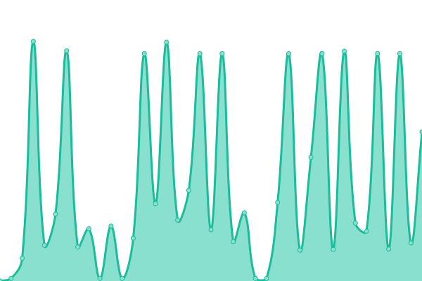 2453ms
     
 | 

<a href="https://bvenkysubbu.github.io/tymlymonitor/history/sowparnika-swastika-1">99.64%</a>
    

|  [Prestige Lakeside Habitat Tower 1](https://cloud.tymly.in/status/1102) | 🟥 Down | [prestige-lakeside-habitat-tower-1.yml](https://github.com/bvenkysubbu/tymlymonitor/commits/HEAD/history/prestige-lakeside-habitat-tower-1.yml) | 

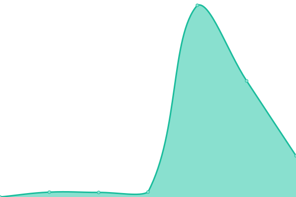 448ms
     
 | 

<a href="https://bvenkysubbu.github.io/tymlymonitor/history/prestige-lakeside-habitat-tower-1">0.00%</a>
    

|  [Prestige Lakeside Habitat Tower 2 and 3](https://cloud.tymly.in/status/1103) | 🟥 Down | [prestige-lakeside-habitat-tower-2-and-3.yml](https://github.com/bvenkysubbu/tymlymonitor/commits/HEAD/history/prestige-lakeside-habitat-tower-2-and-3.yml) | 

 882ms
     
 | 

<a href="https://bvenkysubbu.github.io/tymlymonitor/history/prestige-lakeside-habitat-tower-2-and-3">0.00%</a>
    

|  [Prestige Lakeside Habitat Tower 4](https://cloud.tymly.in/status/1104) | 🟥 Down | [prestige-lakeside-habitat-tower-4.yml](https://github.com/bvenkysubbu/tymlymonitor/commits/HEAD/history/prestige-lakeside-habitat-tower-4.yml) | 

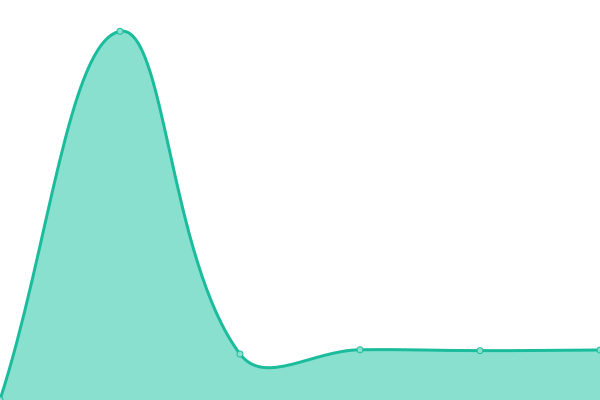 467ms
     
 | 

<a href="https://bvenkysubbu.github.io/tymlymonitor/history/prestige-lakeside-habitat-tower-4">0.00%</a>
    

|  [Prestige Lakeside Habitat Tower 5 and 6](https://cloud.tymly.in/status/1105) | 🟥 Down | [prestige-lakeside-habitat-tower-5-and-6.yml](https://github.com/bvenkysubbu/tymlymonitor/commits/HEAD/history/prestige-lakeside-habitat-tower-5-and-6.yml) | 

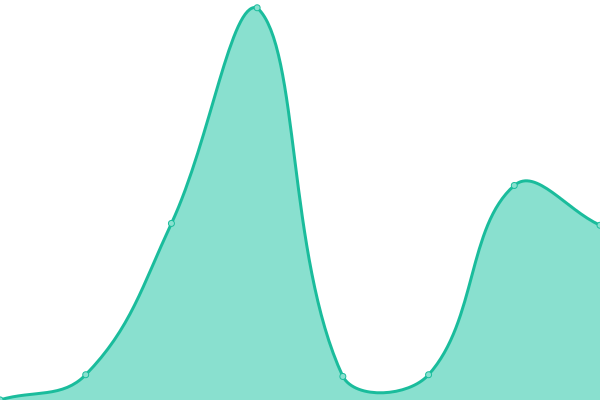 2953ms
     
 | 

<a href="https://bvenkysubbu.github.io/tymlymonitor/history/prestige-lakeside-habitat-tower-5-and-6">0.48%</a>
    

|  [Prestige Lakeside Habitat Tower 7 and 8](https://cloud.tymly.in/status/1106) | 🟥 Down | [prestige-lakeside-habitat-tower-7-and-8.yml](https://github.com/bvenkysubbu/tymlymonitor/commits/HEAD/history/prestige-lakeside-habitat-tower-7-and-8.yml) | 

 228ms
     
 | 

<a href="https://bvenkysubbu.github.io/tymlymonitor/history/prestige-lakeside-habitat-tower-7-and-8">0.00%</a>
    

|  [Prestige Lakeside Habitat Tower 12](https://cloud.tymly.in/status/1107) | 🟥 Down | [prestige-lakeside-habitat-tower-12.yml](https://github.com/bvenkysubbu/tymlymonitor/commits/HEAD/history/prestige-lakeside-habitat-tower-12.yml) | 

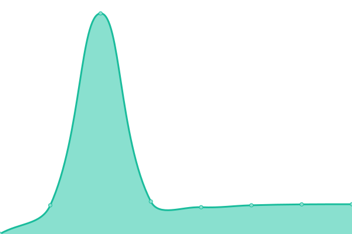 228ms
     
 | 

<a href="https://bvenkysubbu.github.io/tymlymonitor/history/prestige-lakeside-habitat-tower-12">100.00%</a>
    

|  [Prestige Lakeside Habitat Tower 14](https://cloud.tymly.in/status/1108) | 🟥 Down | [prestige-lakeside-habitat-tower-14.yml](https://github.com/bvenkysubbu/tymlymonitor/commits/HEAD/history/prestige-lakeside-habitat-tower-14.yml) | 

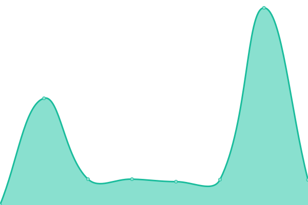 435ms
     
 | 

<a href="https://bvenkysubbu.github.io/tymlymonitor/history/prestige-lakeside-habitat-tower-14">0.00%</a>
    

|  [Prestige Lakeside Habitat Tower 15 and 16](https://cloud.tymly.in/status/1109) | 🟥 Down | [prestige-lakeside-habitat-tower-15-and-16.yml](https://github.com/bvenkysubbu/tymlymonitor/commits/HEAD/history/prestige-lakeside-habitat-tower-15-and-16.yml) | 

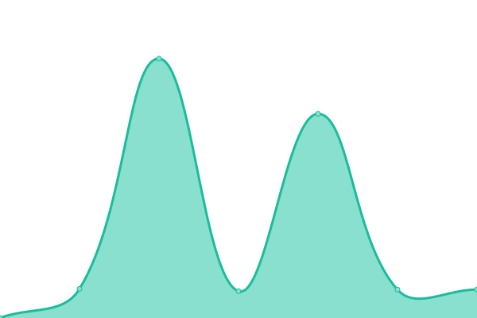 477ms
     
 | 

<a href="https://bvenkysubbu.github.io/tymlymonitor/history/prestige-lakeside-habitat-tower-15-and-16">100.00%</a>
    

|  [Prestige Lakeside Habitat Tower 17](https://cloud.tymly.in/status/1110) | 🟥 Down | [prestige-lakeside-habitat-tower-17.yml](https://github.com/bvenkysubbu/tymlymonitor/commits/HEAD/history/prestige-lakeside-habitat-tower-17.yml) | 

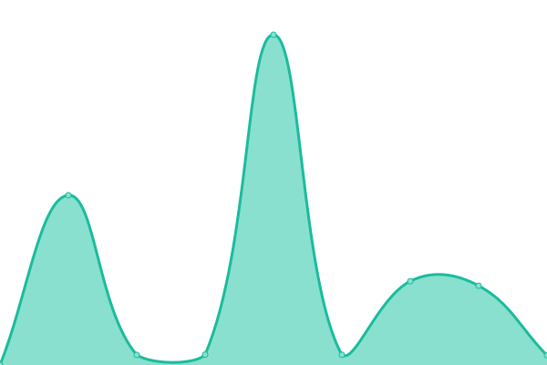 228ms
     
 | 

<a href="https://bvenkysubbu.github.io/tymlymonitor/history/prestige-lakeside-habitat-tower-17">100.00%</a>
    

|  [Prestige Lakeside Habitat Tower 18](https://cloud.tymly.in/status/1111) | 🟥 Down | [prestige-lakeside-habitat-tower-18.yml](https://github.com/bvenkysubbu/tymlymonitor/commits/HEAD/history/prestige-lakeside-habitat-tower-18.yml) | 

 493ms
     
 | 

<a href="https://bvenkysubbu.github.io/tymlymonitor/history/prestige-lakeside-habitat-tower-18">100.00%</a>
    

|  [Prestige Lakeside Habitat Tower 19](https://cloud.tymly.in/status/1112) | 🟥 Down | [prestige-lakeside-habitat-tower-19.yml](https://github.com/bvenkysubbu/tymlymonitor/commits/HEAD/history/prestige-lakeside-habitat-tower-19.yml) | 

 457ms
     
 | 

<a href="https://bvenkysubbu.github.io/tymlymonitor/history/prestige-lakeside-habitat-tower-19">100.00%</a>
    

|  [Prestige Lakeside Habitat Tower 20](https://cloud.tymly.in/status/1113) | 🟥 Down | [prestige-lakeside-habitat-tower-20.yml](https://github.com/bvenkysubbu/tymlymonitor/commits/HEAD/history/prestige-lakeside-habitat-tower-20.yml) | 

 721ms
     
 | 

<a href="https://bvenkysubbu.github.io/tymlymonitor/history/prestige-lakeside-habitat-tower-20">0.00%</a>
    

|  [Prestige Lakeside Habitat Tower 21](https://cloud.tymly.in/status/1114) | 🟥 Down | [prestige-lakeside-habitat-tower-21.yml](https://github.com/bvenkysubbu/tymlymonitor/commits/HEAD/history/prestige-lakeside-habitat-tower-21.yml) | 

 229ms
     
 | 

<a href="https://bvenkysubbu.github.io/tymlymonitor/history/prestige-lakeside-habitat-tower-21">100.00%</a>
    

|  [Prestige Lakeside Habitat Tower 22](https://cloud.tymly.in/status/1115) | 🟥 Down | [prestige-lakeside-habitat-tower-22.yml](https://github.com/bvenkysubbu/tymlymonitor/commits/HEAD/history/prestige-lakeside-habitat-tower-22.yml) | 

 503ms
     
 | 

<a href="https://bvenkysubbu.github.io/tymlymonitor/history/prestige-lakeside-habitat-tower-22">100.00%</a>
    

|  [Prestige Lakeside Habitat Tower 9](https://cloud.tymly.in/status/1116) | 🟥 Down | [prestige-lakeside-habitat-tower-9.yml](https://github.com/bvenkysubbu/tymlymonitor/commits/HEAD/history/prestige-lakeside-habitat-tower-9.yml) | 

 661ms
     
 | 

<a href="https://bvenkysubbu.github.io/tymlymonitor/history/prestige-lakeside-habitat-tower-9">100.00%</a>
    

|  [Prestige Lakeside Habitat Tower 10](https://cloud.tymly.in/status/1117) | 🟥 Down | [prestige-lakeside-habitat-tower-10.yml](https://github.com/bvenkysubbu/tymlymonitor/commits/HEAD/history/prestige-lakeside-habitat-tower-10.yml) | 

 229ms
     
 | 

<a href="https://bvenkysubbu.github.io/tymlymonitor/history/prestige-lakeside-habitat-tower-10">0.00%</a>
    

|  [Prestige Lakeside Habitat Tower 11](https://cloud.tymly.in/status/1118) | 🟥 Down | [prestige-lakeside-habitat-tower-11.yml](https://github.com/bvenkysubbu/tymlymonitor/commits/HEAD/history/prestige-lakeside-habitat-tower-11.yml) | 

 229ms
     
 | 

<a href="https://bvenkysubbu.github.io/tymlymonitor/history/prestige-lakeside-habitat-tower-11">100.00%</a>
    

|  [Prestige Lakeside Habitat Tower 23](https://cloud.tymly.in/status/1119) | 🟥 Down | [prestige-lakeside-habitat-tower-23.yml](https://github.com/bvenkysubbu/tymlymonitor/commits/HEAD/history/prestige-lakeside-habitat-tower-23.yml) | 

 231ms
     
 | 

<a href="https://bvenkysubbu.github.io/tymlymonitor/history/prestige-lakeside-habitat-tower-23">100.00%</a>
    

|  [Prestige Lakeside Habitat Tower 24](https://cloud.tymly.in/status/1120) | 🟥 Down | [prestige-lakeside-habitat-tower-24.yml](https://github.com/bvenkysubbu/tymlymonitor/commits/HEAD/history/prestige-lakeside-habitat-tower-24.yml) | 

 228ms
     
 | 

<a href="https://bvenkysubbu.github.io/tymlymonitor/history/prestige-lakeside-habitat-tower-24">0.00%</a>
    

|  [Prestige Lakeside Habitat 20](https://cloud.tymly.in/status/1121) | 🟥 Down | [prestige-lakeside-habitat-20.yml](https://github.com/bvenkysubbu/tymlymonitor/commits/HEAD/history/prestige-lakeside-habitat-20.yml) | 

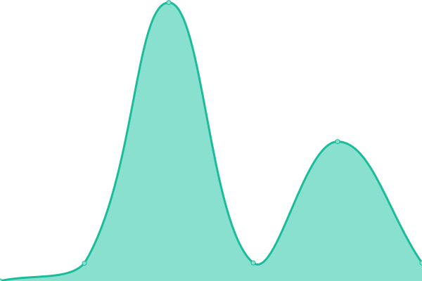 441ms
     
 | 

<a href="https://bvenkysubbu.github.io/tymlymonitor/history/prestige-lakeside-habitat-20">100.00%</a>
    

|  [Prestige Lakeside Habitat 21](https://cloud.tymly.in/status/1122) | 🟥 Down | [prestige-lakeside-habitat-21.yml](https://github.com/bvenkysubbu/tymlymonitor/commits/HEAD/history/prestige-lakeside-habitat-21.yml) | 

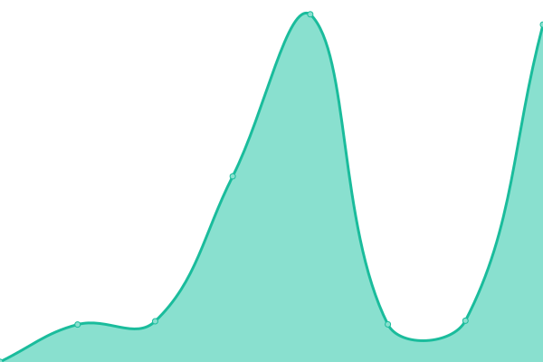 229ms
     
 | 

<a href="https://bvenkysubbu.github.io/tymlymonitor/history/prestige-lakeside-habitat-21">100.00%</a>
    

|  [Prestige Lakeside Habitat 22](https://cloud.tymly.in/status/1123) | 🟥 Down | [prestige-lakeside-habitat-22.yml](https://github.com/bvenkysubbu/tymlymonitor/commits/HEAD/history/prestige-lakeside-habitat-22.yml) | 

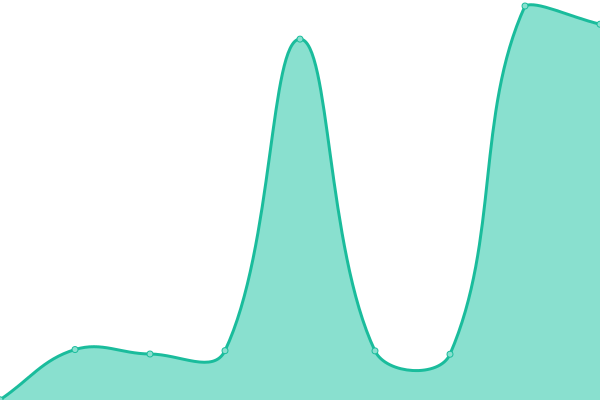 231ms
     
 | 

<a href="https://bvenkysubbu.github.io/tymlymonitor/history/prestige-lakeside-habitat-22">100.00%</a>
    

|  [Prestige Lakeside Habitat 23](https://cloud.tymly.in/status/1124) | 🟥 Down | [prestige-lakeside-habitat-23.yml](https://github.com/bvenkysubbu/tymlymonitor/commits/HEAD/history/prestige-lakeside-habitat-23.yml) | 

 667ms
     
 | 

<a href="https://bvenkysubbu.github.io/tymlymonitor/history/prestige-lakeside-habitat-23">100.00%</a>
    

|  [Prestige Lakeside Habitat 24](https://cloud.tymly.in/status/1125) | 🟥 Down | [prestige-lakeside-habitat-24.yml](https://github.com/bvenkysubbu/tymlymonitor/commits/HEAD/history/prestige-lakeside-habitat-24.yml) | 

 507ms
     
 | 

<a href="https://bvenkysubbu.github.io/tymlymonitor/history/prestige-lakeside-habitat-24">100.00%</a>
    

|  [Prestige Lakeside Habitat 25](https://cloud.tymly.in/status/1126) | 🟥 Down | [prestige-lakeside-habitat-25.yml](https://github.com/bvenkysubbu/tymlymonitor/commits/HEAD/history/prestige-lakeside-habitat-25.yml) | 

 652ms
     
 | 

<a href="https://bvenkysubbu.github.io/tymlymonitor/history/prestige-lakeside-habitat-25">100.00%</a>
    

|  [SBC Nest A Block](https://cloud.tymly.in/status/1127) | 🟩 Up | [sbc-nest-a-block.yml](https://github.com/bvenkysubbu/tymlymonitor/commits/HEAD/history/sbc-nest-a-block.yml) | 

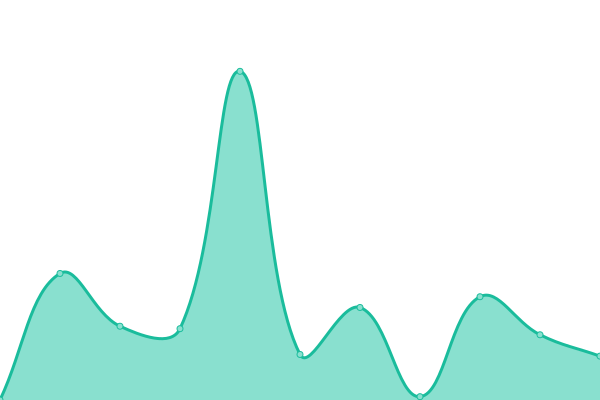 6887ms
     
 | 

<a href="https://bvenkysubbu.github.io/tymlymonitor/history/sbc-nest-a-block">100.00%</a>
    

|  [SBC Nest B Block](https://cloud.tymly.in/status/1128) | 🟩 Up | [sbc-nest-b-block.yml](https://github.com/bvenkysubbu/tymlymonitor/commits/HEAD/history/sbc-nest-b-block.yml) | 

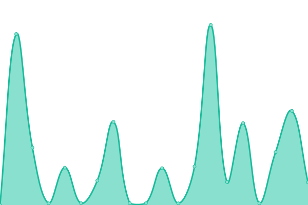 5450ms
     
 | 

<a href="https://bvenkysubbu.github.io/tymlymonitor/history/sbc-nest-b-block">99.80%</a>
    

|  [VBHC Serene Town A Block](https://cloud.tymly.in/status/1129) | 🟩 Up | [vbhc-serene-town-a-block.yml](https://github.com/bvenkysubbu/tymlymonitor/commits/HEAD/history/vbhc-serene-town-a-block.yml) | 

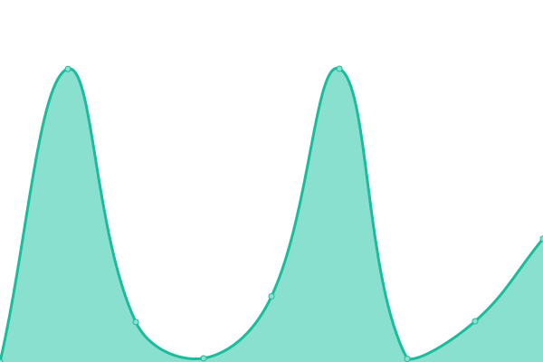 4262ms
     
 | 

<a href="https://bvenkysubbu.github.io/tymlymonitor/history/vbhc-serene-town-a-block">97.20%</a>
    

|  [VBHC Serene Town B Block](https://cloud.tymly.in/status/1130) | 🟥 Down | [vbhc-serene-town-b-block.yml](https://github.com/bvenkysubbu/tymlymonitor/commits/HEAD/history/vbhc-serene-town-b-block.yml) | 

 5363ms
     
 | 

<a href="https://bvenkysubbu.github.io/tymlymonitor/history/vbhc-serene-town-b-block">42.75%</a>
    

|  [VBHC Serene Town D Block](https://cloud.tymly.in/status/1131) | 🟩 Up | [vbhc-serene-town-d-block.yml](https://github.com/bvenkysubbu/tymlymonitor/commits/HEAD/history/vbhc-serene-town-d-block.yml) | 

 4596ms
     
 | 

<a href="https://bvenkysubbu.github.io/tymlymonitor/history/vbhc-serene-town-d-block">92.95%</a>
    

|  [VBHC Serene Town C Block](https://cloud.tymly.in/status/1132) | 🟩 Up | [vbhc-serene-town-c-block.yml](https://github.com/bvenkysubbu/tymlymonitor/commits/HEAD/history/vbhc-serene-town-c-block.yml) | 

 6490ms
     
 | 

<a href="https://bvenkysubbu.github.io/tymlymonitor/history/vbhc-serene-town-c-block">99.45%</a>
    

|  [Desai Grandeur 1](https://cloud.tymly.in/status/1133) | 🟥 Down | [desai-grandeur-1.yml](https://github.com/bvenkysubbu/tymlymonitor/commits/HEAD/history/desai-grandeur-1.yml) | 

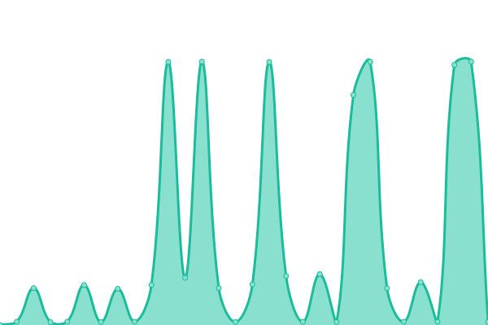 694ms
     
 | 

<a href="https://bvenkysubbu.github.io/tymlymonitor/history/desai-grandeur-1">100.00%</a>
    

|  [Desai Grandeur 2](https://cloud.tymly.in/status/1134) | 🟥 Down | [desai-grandeur-2.yml](https://github.com/bvenkysubbu/tymlymonitor/commits/HEAD/history/desai-grandeur-2.yml) | 

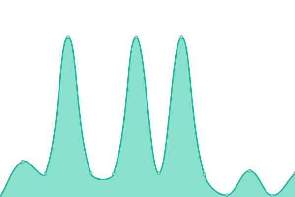 228ms
     
 | 

<a href="https://bvenkysubbu.github.io/tymlymonitor/history/desai-grandeur-2">100.00%</a>
    

|  [Madhuban Brindavan A Block](https://cloud.tymly.in/status/1135) | 🟩 Up | [madhuban-brindavan-a-block.yml](https://github.com/bvenkysubbu/tymlymonitor/commits/HEAD/history/madhuban-brindavan-a-block.yml) | 

 4088ms
     
 | 

<a href="https://bvenkysubbu.github.io/tymlymonitor/history/madhuban-brindavan-a-block">93.55%</a>
    

|  [Madhuban Brindavan B Block](https://cloud.tymly.in/status/1136) | 🟩 Up | [madhuban-brindavan-b-block.yml](https://github.com/bvenkysubbu/tymlymonitor/commits/HEAD/history/madhuban-brindavan-b-block.yml) | 

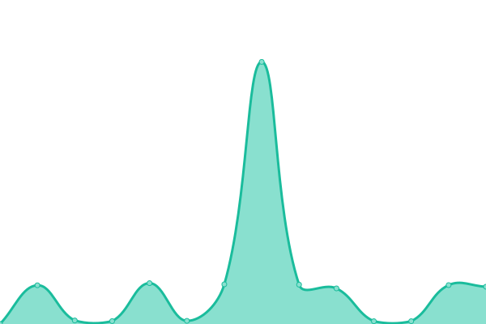 2442ms
     
 | 

<a href="https://bvenkysubbu.github.io/tymlymonitor/history/madhuban-brindavan-b-block">30.47%</a>
    

|  [Dasta Concerto Entrance](https://cloud.tymly.in/status/1137) | 🟥 Down | [dasta-concerto-entrance.yml](https://github.com/bvenkysubbu/tymlymonitor/commits/HEAD/history/dasta-concerto-entrance.yml) | 

 4005ms
     
 | 

<a href="https://bvenkysubbu.github.io/tymlymonitor/history/dasta-concerto-entrance">5.03%</a>
    

|  [Dasta Concerto Basement](https://cloud.tymly.in/status/1138) | 🟩 Up | [dasta-concerto-basement.yml](https://github.com/bvenkysubbu/tymlymonitor/commits/HEAD/history/dasta-concerto-basement.yml) | 

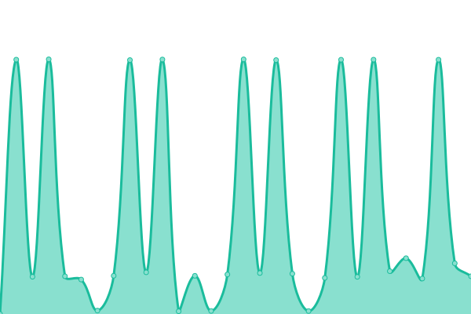 8284ms
     
 | 

<a href="https://bvenkysubbu.github.io/tymlymonitor/history/dasta-concerto-basement">93.85%</a>
    

|  [Sunshine Silicon Citi 2](https://cloud.tymly.in/status/1139) | 🟩 Up | [sunshine-silicon-citi-2.yml](https://github.com/bvenkysubbu/tymlymonitor/commits/HEAD/history/sunshine-silicon-citi-2.yml) | 

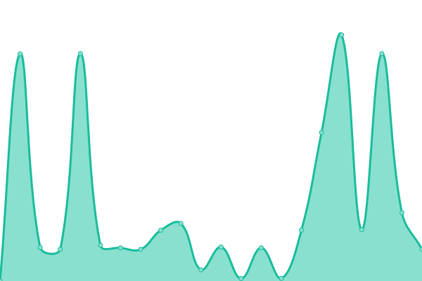 1392ms
     
 | 

<a href="https://bvenkysubbu.github.io/tymlymonitor/history/sunshine-silicon-citi-2">6.18%</a>
    

|  [Amrutha Sarovar Office](https://cloud.tymly.in/status/1140) | 🟥 Down | [amrutha-sarovar-office.yml](https://github.com/bvenkysubbu/tymlymonitor/commits/HEAD/history/amrutha-sarovar-office.yml) | 

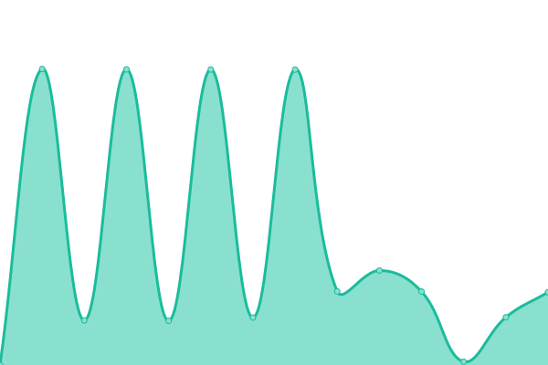 360ms
     
 | 

<a href="https://bvenkysubbu.github.io/tymlymonitor/history/amrutha-sarovar-office">0.00%</a>
    

|  [Brigade Cosmopolis Clubhouse Entrance](https://cloud.tymly.in/status/1141) | 🟩 Up | [brigade-cosmopolis-clubhouse-entrance.yml](https://github.com/bvenkysubbu/tymlymonitor/commits/HEAD/history/brigade-cosmopolis-clubhouse-entrance.yml) | 

 2434ms
     
 | 

<a href="https://bvenkysubbu.github.io/tymlymonitor/history/brigade-cosmopolis-clubhouse-entrance">99.80%</a>
    

|  [Sterling Ascentia Tower 6](https://cloud.tymly.in/status/1142) | 🟩 Up | [sterling-ascentia-tower-6.yml](https://github.com/bvenkysubbu/tymlymonitor/commits/HEAD/history/sterling-ascentia-tower-6.yml) | 

 3803ms
     
 | 

<a href="https://bvenkysubbu.github.io/tymlymonitor/history/sterling-ascentia-tower-6">98.05%</a>
    

|  [Sterling Ascentia Tower 5](https://cloud.tymly.in/status/1143) | 🟩 Up | [sterling-ascentia-tower-5.yml](https://github.com/bvenkysubbu/tymlymonitor/commits/HEAD/history/sterling-ascentia-tower-5.yml) | 

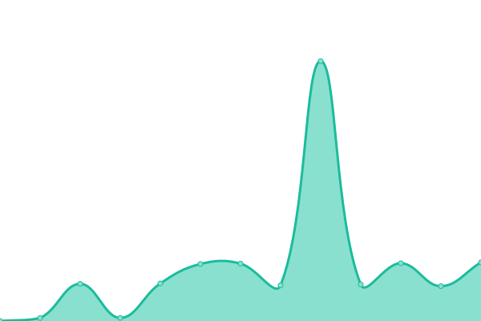 5427ms
     
 | 

<a href="https://bvenkysubbu.github.io/tymlymonitor/history/sterling-ascentia-tower-5">100.00%</a>
    

|  [Brigade Cosmopolis Clubhouse End](https://cloud.tymly.in/status/1145) | 🟥 Down | [brigade-cosmopolis-clubhouse-end.yml](https://github.com/bvenkysubbu/tymlymonitor/commits/HEAD/history/brigade-cosmopolis-clubhouse-end.yml) | 

 3763ms
     
 | 

<a href="https://bvenkysubbu.github.io/tymlymonitor/history/brigade-cosmopolis-clubhouse-end">39.50%</a>
    

<!--end: status pages-->

[**Visit our status website →**](https://upptime.github.io/upptime)

## 📄 License

- Powered by: [Upptime](https://github.com/upptime/upptime)
- Code: [MIT](./LICENSE) © [Upptime](https://upptime.js.org)
- Data in the `./history` directory: [Open Database License](https://opendatacommons.org/licenses/odbl/1-0/)
