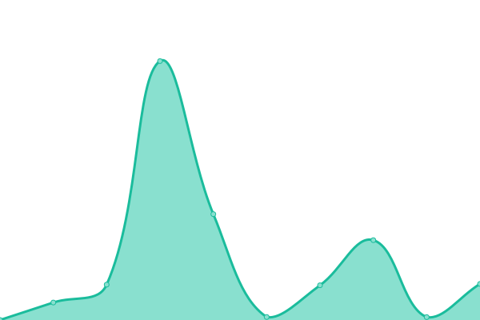

# [📈 Live Status](https://upptime.github.io/upptime): <!--live status--> **🟧 Partial outage**

This repository contains the open-source uptime monitor and status page for [Upptime](https://upptime.js.org), powered by [Upptime](https://github.com/upptime/upptime).

With [Upptime](https://upptime.js.org), you can get your own unlimited and free uptime monitor and status page, powered entirely by a GitHub repository. We use [Issues](https://github.com/upptime/upptime/issues) as incident reports, [Actions](https://github.com/bvenkysubbu/tymlymonitor/actions) as uptime monitors, and [Pages](https://upptime.github.io/upptime) for the status page.

<!--start: status pages-->
<!-- This summary is generated by Upptime (https://github.com/upptime/upptime) -->
<!-- Do not edit this manually, your changes will be overwritten -->
<!-- prettier-ignore -->
| URL | Status | History | Response Time | Uptime |
| --- | ------ | ------- | ------------- | ------ |
|  [Trifecta Esplanade](https://cloud.tymly.in/status/1003) | 🟩 Up | [trifecta-esplanade.yml](https://github.com/bvenkysubbu/tymlymonitor/commits/HEAD/history/trifecta-esplanade.yml) | 

 8386ms
     
 | 

<a href="https://bvenkysubbu.github.io/tymlymonitor/history/trifecta-esplanade">68.30%</a>
    

|  [Casa Gopalan Block B Lift](https://cloud.tymly.in/status/1005) | 🟩 Up | [casa-gopalan-block-b-lift.yml](https://github.com/bvenkysubbu/tymlymonitor/commits/HEAD/history/casa-gopalan-block-b-lift.yml) | 

 5082ms
     
 | 

<a href="https://bvenkysubbu.github.io/tymlymonitor/history/casa-gopalan-block-b-lift">95.39%</a>
    

|  [Casa Gopalan Block A Lift](https://cloud.tymly.in/status/1006) | 🟩 Up | [casa-gopalan-block-a-lift.yml](https://github.com/bvenkysubbu/tymlymonitor/commits/HEAD/history/casa-gopalan-block-a-lift.yml) | 

 5449ms
     
 | 

<a href="https://bvenkysubbu.github.io/tymlymonitor/history/casa-gopalan-block-a-lift">100.00%</a>
    

|  [Gayathri Goodlife](https://cloud.tymly.in/status/1009) | 🟩 Up | [gayathri-goodlife.yml](https://github.com/bvenkysubbu/tymlymonitor/commits/HEAD/history/gayathri-goodlife.yml) | 

 7184ms
     
 | 

<a href="https://bvenkysubbu.github.io/tymlymonitor/history/gayathri-goodlife">95.10%</a>
    

|  [Amrutha Value](https://cloud.tymly.in/status/1010) | 🟩 Up | [amrutha-value.yml](https://github.com/bvenkysubbu/tymlymonitor/commits/HEAD/history/amrutha-value.yml) | 

 9803ms
     
 | 

<a href="https://bvenkysubbu.github.io/tymlymonitor/history/amrutha-value">99.38%</a>
    

|  [Sterling Shalom C Block](https://cloud.tymly.in/status/1011) | 🟩 Up | [sterling-shalom-c-block.yml](https://github.com/bvenkysubbu/tymlymonitor/commits/HEAD/history/sterling-shalom-c-block.yml) | 

 3921ms
     
 | 

<a href="https://bvenkysubbu.github.io/tymlymonitor/history/sterling-shalom-c-block">100.00%</a>
    

|  [Sterling Shalom D Block](https://cloud.tymly.in/status/1012) | 🟩 Up | [sterling-shalom-d-block.yml](https://github.com/bvenkysubbu/tymlymonitor/commits/HEAD/history/sterling-shalom-d-block.yml) | 

 4216ms
     
 | 

<a href="https://bvenkysubbu.github.io/tymlymonitor/history/sterling-shalom-d-block">91.42%</a>
    

|  [Sterling Shalom F Block](https://cloud.tymly.in/status/1013) | 🟩 Up | [sterling-shalom-f-block.yml](https://github.com/bvenkysubbu/tymlymonitor/commits/HEAD/history/sterling-shalom-f-block.yml) | 

 5604ms
     
 | 

<a href="https://bvenkysubbu.github.io/tymlymonitor/history/sterling-shalom-f-block">51.53%</a>
    

|  [Sai Raghavendras Bloomfields](https://cloud.tymly.in/status/1014) | 🟩 Up | [sai-raghavendras-bloomfields.yml](https://github.com/bvenkysubbu/tymlymonitor/commits/HEAD/history/sai-raghavendras-bloomfields.yml) | 

 2265ms
     
 | 

<a href="https://bvenkysubbu.github.io/tymlymonitor/history/sai-raghavendras-bloomfields">64.28%</a>
    

|  [Amrutha Sarovar](https://cloud.tymly.in/status/1016) | 🟥 Down | [amrutha-sarovar.yml](https://github.com/bvenkysubbu/tymlymonitor/commits/HEAD/history/amrutha-sarovar.yml) | 

 684ms
     
 | 

<a href="https://bvenkysubbu.github.io/tymlymonitor/history/amrutha-sarovar">100.00%</a>
    

|  [Trifecta Esplanade Security](https://cloud.tymly.in/status/1017) | 🟩 Up | [trifecta-esplanade-security.yml](https://github.com/bvenkysubbu/tymlymonitor/commits/HEAD/history/trifecta-esplanade-security.yml) | 

 3966ms
     
 | 

<a href="https://bvenkysubbu.github.io/tymlymonitor/history/trifecta-esplanade-security">79.78%</a>
    

|  [SBB Touchstone Reborn](https://cloud.tymly.in/status/1018) | 🟩 Up | [sbb-touchstone-reborn.yml](https://github.com/bvenkysubbu/tymlymonitor/commits/HEAD/history/sbb-touchstone-reborn.yml) | 

 5378ms
     
 | 

<a href="https://bvenkysubbu.github.io/tymlymonitor/history/sbb-touchstone-reborn">99.63%</a>
    

|  [United Elysium](https://cloud.tymly.in/status/1019) | 🟥 Down | [united-elysium.yml](https://github.com/bvenkysubbu/tymlymonitor/commits/HEAD/history/united-elysium.yml) | 

 10021ms
     
 | 

<a href="https://bvenkysubbu.github.io/tymlymonitor/history/united-elysium">38.78%</a>
    

|  [Greenville Whitefield](https://cloud.tymly.in/status/1020) | 🟩 Up | [greenville-whitefield.yml](https://github.com/bvenkysubbu/tymlymonitor/commits/HEAD/history/greenville-whitefield.yml) | 

 6963ms
     
 | 

<a href="https://bvenkysubbu.github.io/tymlymonitor/history/greenville-whitefield">99.52%</a>
    

|  [Sunshine Silicon Citi](https://cloud.tymly.in/status/1021) | 🟩 Up | [sunshine-silicon-citi.yml](https://github.com/bvenkysubbu/tymlymonitor/commits/HEAD/history/sunshine-silicon-citi.yml) | 

 4559ms
     
 | 

<a href="https://bvenkysubbu.github.io/tymlymonitor/history/sunshine-silicon-citi">100.00%</a>
    

|  [Nitesh Forest Hills and Flush Meadows](https://cloud.tymly.in/status/1023) | 🟩 Up | [nitesh-forest-hills-and-flush-meadows.yml](https://github.com/bvenkysubbu/tymlymonitor/commits/HEAD/history/nitesh-forest-hills-and-flush-meadows.yml) | 

 3567ms
     
 | 

<a href="https://bvenkysubbu.github.io/tymlymonitor/history/nitesh-forest-hills-and-flush-meadows">99.78%</a>
    

|  [Sterling Shalom A Block](https://cloud.tymly.in/status/1024) | 🟩 Up | [sterling-shalom-a-block.yml](https://github.com/bvenkysubbu/tymlymonitor/commits/HEAD/history/sterling-shalom-a-block.yml) | 

 5511ms
     
 | 

<a href="https://bvenkysubbu.github.io/tymlymonitor/history/sterling-shalom-a-block">100.00%</a>
    

|  [DSR Sunrise Towers](https://cloud.tymly.in/status/1025) | 🟩 Up | [dsr-sunrise-towers.yml](https://github.com/bvenkysubbu/tymlymonitor/commits/HEAD/history/dsr-sunrise-towers.yml) | 

 4729ms
     
 | 

<a href="https://bvenkysubbu.github.io/tymlymonitor/history/dsr-sunrise-towers">100.00%</a>
    

|  [United Elysium 2](https://cloud.tymly.in/status/1026) | 🟩 Up | [united-elysium-2.yml](https://github.com/bvenkysubbu/tymlymonitor/commits/HEAD/history/united-elysium-2.yml) | 

 6202ms
     
 | 

<a href="https://bvenkysubbu.github.io/tymlymonitor/history/united-elysium-2">99.04%</a>
    

|  [DSR Sunrise Towers 2](https://cloud.tymly.in/status/1027) | 🟩 Up | [dsr-sunrise-towers-2.yml](https://github.com/bvenkysubbu/tymlymonitor/commits/HEAD/history/dsr-sunrise-towers-2.yml) | 

 6714ms
     
 | 

<a href="https://bvenkysubbu.github.io/tymlymonitor/history/dsr-sunrise-towers-2">88.60%</a>
    

|  [Adithya Pristine KMC](https://cloud.tymly.in/status/1028) | 🟩 Up | [adithya-pristine-kmc.yml](https://github.com/bvenkysubbu/tymlymonitor/commits/HEAD/history/adithya-pristine-kmc.yml) | 

 9344ms
     
 | 

<a href="https://bvenkysubbu.github.io/tymlymonitor/history/adithya-pristine-kmc">64.11%</a>
    

|  [Sraddha Whitecliff](https://cloud.tymly.in/status/1033) | 🟩 Up | [sraddha-whitecliff.yml](https://github.com/bvenkysubbu/tymlymonitor/commits/HEAD/history/sraddha-whitecliff.yml) | 

 7635ms
     
 | 

<a href="https://bvenkysubbu.github.io/tymlymonitor/history/sraddha-whitecliff">99.56%</a>
    

|  [Sraddha Whitecliff 2](https://cloud.tymly.in/status/1034) | 🟩 Up | [sraddha-whitecliff-2.yml](https://github.com/bvenkysubbu/tymlymonitor/commits/HEAD/history/sraddha-whitecliff-2.yml) | 

 4671ms
     
 | 

<a href="https://bvenkysubbu.github.io/tymlymonitor/history/sraddha-whitecliff-2">99.56%</a>
    

|  [Sraddha Whitecliff 3](https://cloud.tymly.in/status/1035) | 🟩 Up | [sraddha-whitecliff-3.yml](https://github.com/bvenkysubbu/tymlymonitor/commits/HEAD/history/sraddha-whitecliff-3.yml) | 

 4266ms
     
 | 

<a href="https://bvenkysubbu.github.io/tymlymonitor/history/sraddha-whitecliff-3">99.81%</a>
    

|  [Sowparnika Ananda](https://cloud.tymly.in/status/1036) | 🟩 Up | [sowparnika-ananda.yml](https://github.com/bvenkysubbu/tymlymonitor/commits/HEAD/history/sowparnika-ananda.yml) | 

 6156ms
     
 | 

<a href="https://bvenkysubbu.github.io/tymlymonitor/history/sowparnika-ananda">99.56%</a>
    

|  [Wilson Vintage 1](https://cloud.tymly.in/status/1037) | 🟩 Up | [wilson-vintage-1.yml](https://github.com/bvenkysubbu/tymlymonitor/commits/HEAD/history/wilson-vintage-1.yml) | 

 4644ms
     
 | 

<a href="https://bvenkysubbu.github.io/tymlymonitor/history/wilson-vintage-1">98.61%</a>
    

|  [Wilson Vintage 2](https://cloud.tymly.in/status/1038) | 🟩 Up | [wilson-vintage-2.yml](https://github.com/bvenkysubbu/tymlymonitor/commits/HEAD/history/wilson-vintage-2.yml) | 

 4697ms
     
 | 

<a href="https://bvenkysubbu.github.io/tymlymonitor/history/wilson-vintage-2">98.81%</a>
    

|  [SNR Silver Ripples](https://cloud.tymly.in/status/1039) | 🟩 Up | [snr-silver-ripples.yml](https://github.com/bvenkysubbu/tymlymonitor/commits/HEAD/history/snr-silver-ripples.yml) | 

 7730ms
     
 | 

<a href="https://bvenkysubbu.github.io/tymlymonitor/history/snr-silver-ripples">81.11%</a>
    

|  [SNR Silver Ripples 2](https://cloud.tymly.in/status/1040) | 🟩 Up | [snr-silver-ripples-2.yml](https://github.com/bvenkysubbu/tymlymonitor/commits/HEAD/history/snr-silver-ripples-2.yml) | 

 5392ms
     
 | 

<a href="https://bvenkysubbu.github.io/tymlymonitor/history/snr-silver-ripples-2">88.32%</a>
    

|  [Adarsh Vihar](https://cloud.tymly.in/status/1041) | 🟥 Down | [adarsh-vihar.yml](https://github.com/bvenkysubbu/tymlymonitor/commits/HEAD/history/adarsh-vihar.yml) | 

 4967ms
     
 | 

<a href="https://bvenkysubbu.github.io/tymlymonitor/history/adarsh-vihar">36.31%</a>
    

|  [Urban Greens](https://cloud.tymly.in/status/1046) | 🟩 Up | [urban-greens.yml](https://github.com/bvenkysubbu/tymlymonitor/commits/HEAD/history/urban-greens.yml) | 

 6454ms
     
 | 

<a href="https://bvenkysubbu.github.io/tymlymonitor/history/urban-greens">100.00%</a>
    

|  [Nitesh Flushing Meadows Block B](https://cloud.tymly.in/status/1047) | 🟩 Up | [nitesh-flushing-meadows-block-b.yml](https://github.com/bvenkysubbu/tymlymonitor/commits/HEAD/history/nitesh-flushing-meadows-block-b.yml) | 

 8978ms
     
 | 

<a href="https://bvenkysubbu.github.io/tymlymonitor/history/nitesh-flushing-meadows-block-b">77.89%</a>
    

|  [Ruchira Lilium v2](https://cloud.tymly.in/status/1048) | 🟩 Up | [ruchira-lilium-v2.yml](https://github.com/bvenkysubbu/tymlymonitor/commits/HEAD/history/ruchira-lilium-v2.yml) | 

 10151ms
     
 | 

<a href="https://bvenkysubbu.github.io/tymlymonitor/history/ruchira-lilium-v2">81.63%</a>
    

|  [Nitesh Flushing Meadows Block D](https://cloud.tymly.in/status/1049) | 🟩 Up | [nitesh-flushing-meadows-block-d.yml](https://github.com/bvenkysubbu/tymlymonitor/commits/HEAD/history/nitesh-flushing-meadows-block-d.yml) | 

 6427ms
     
 | 

<a href="https://bvenkysubbu.github.io/tymlymonitor/history/nitesh-flushing-meadows-block-d">83.40%</a>
    

|  [Nitesh Forest Hills Block C](https://cloud.tymly.in/status/1050) | 🟩 Up | [nitesh-forest-hills-block-c.yml](https://github.com/bvenkysubbu/tymlymonitor/commits/HEAD/history/nitesh-forest-hills-block-c.yml) | 

 6386ms
     
 | 

<a href="https://bvenkysubbu.github.io/tymlymonitor/history/nitesh-forest-hills-block-c">94.44%</a>
    

|  [Nitesh Forest Hills Block B](https://cloud.tymly.in/status/1051) | 🟩 Up | [nitesh-forest-hills-block-b.yml](https://github.com/bvenkysubbu/tymlymonitor/commits/HEAD/history/nitesh-forest-hills-block-b.yml) | 

 6856ms
     
 | 

<a href="https://bvenkysubbu.github.io/tymlymonitor/history/nitesh-forest-hills-block-b">96.22%</a>
    

|  [Nitesh Forest Hills Block A](https://cloud.tymly.in/status/1052) | 🟩 Up | [nitesh-forest-hills-block-a.yml](https://github.com/bvenkysubbu/tymlymonitor/commits/HEAD/history/nitesh-forest-hills-block-a.yml) | 

 5078ms
     
 | 

<a href="https://bvenkysubbu.github.io/tymlymonitor/history/nitesh-forest-hills-block-a">52.73%</a>
    

|  [Nitesh Flushing Meadows Block A](https://cloud.tymly.in/status/1053) | 🟩 Up | [nitesh-flushing-meadows-block-a.yml](https://github.com/bvenkysubbu/tymlymonitor/commits/HEAD/history/nitesh-flushing-meadows-block-a.yml) | 

 8606ms
     
 | 

<a href="https://bvenkysubbu.github.io/tymlymonitor/history/nitesh-flushing-meadows-block-a">10.97%</a>
    

|  [Nitesh Flushing Meadows Block C](https://cloud.tymly.in/status/1054) | 🟩 Up | [nitesh-flushing-meadows-block-c.yml](https://github.com/bvenkysubbu/tymlymonitor/commits/HEAD/history/nitesh-flushing-meadows-block-c.yml) | 

 7239ms
     
 | 

<a href="https://bvenkysubbu.github.io/tymlymonitor/history/nitesh-flushing-meadows-block-c">86.80%</a>
    

|  [Sandeep Vihar Club House](https://cloud.tymly.in/status/1055) | 🟥 Down | [sandeep-vihar-club-house.yml](https://github.com/bvenkysubbu/tymlymonitor/commits/HEAD/history/sandeep-vihar-club-house.yml) | 

 707ms
     
 | 

<a href="https://bvenkysubbu.github.io/tymlymonitor/history/sandeep-vihar-club-house">100.00%</a>
    

|  [Prakruthi Villas Sarjapura](https://cloud.tymly.in/status/1058) | 🟩 Up | [prakruthi-villas-sarjapura.yml](https://github.com/bvenkysubbu/tymlymonitor/commits/HEAD/history/prakruthi-villas-sarjapura.yml) | 

 8548ms
     
 | 

<a href="https://bvenkysubbu.github.io/tymlymonitor/history/prakruthi-villas-sarjapura">60.88%</a>
    

|  [PSR Aster 1](https://cloud.tymly.in/status/1059) | 🟩 Up | [psr-aster-1.yml](https://github.com/bvenkysubbu/tymlymonitor/commits/HEAD/history/psr-aster-1.yml) | 

 10381ms
     
 | 

<a href="https://bvenkysubbu.github.io/tymlymonitor/history/psr-aster-1">54.01%</a>
    

|  [PSR Aster 2 G Block](https://cloud.tymly.in/status/1060) | 🟩 Up | [psr-aster-2-g-block.yml](https://github.com/bvenkysubbu/tymlymonitor/commits/HEAD/history/psr-aster-2-g-block.yml) | 

 11440ms
     
 | 

<a href="https://bvenkysubbu.github.io/tymlymonitor/history/psr-aster-2-g-block">84.61%</a>
    

|  [Sowparnika Ananda D Block](https://cloud.tymly.in/status/1061) | 🟩 Up | [sowparnika-ananda-d-block.yml](https://github.com/bvenkysubbu/tymlymonitor/commits/HEAD/history/sowparnika-ananda-d-block.yml) | 

 4294ms
     
 | 

<a href="https://bvenkysubbu.github.io/tymlymonitor/history/sowparnika-ananda-d-block">100.00%</a>
    

|  [Balaji Sunflower](https://cloud.tymly.in/status/1062) | 🟩 Up | [balaji-sunflower.yml](https://github.com/bvenkysubbu/tymlymonitor/commits/HEAD/history/balaji-sunflower.yml) | 

 8360ms
     
 | 

<a href="https://bvenkysubbu.github.io/tymlymonitor/history/balaji-sunflower">98.95%</a>
    

|  [PSR Aster 3 E Block](https://cloud.tymly.in/status/1064) | 🟩 Up | [psr-aster-3-e-block.yml](https://github.com/bvenkysubbu/tymlymonitor/commits/HEAD/history/psr-aster-3-e-block.yml) | 

 7730ms
     
 | 

<a href="https://bvenkysubbu.github.io/tymlymonitor/history/psr-aster-3-e-block">77.18%</a>
    

|  [PSR Aster 4 C Block](https://cloud.tymly.in/status/1065) | 🟩 Up | [psr-aster-4-c-block.yml](https://github.com/bvenkysubbu/tymlymonitor/commits/HEAD/history/psr-aster-4-c-block.yml) | 

 6340ms
     
 | 

<a href="https://bvenkysubbu.github.io/tymlymonitor/history/psr-aster-4-c-block">81.66%</a>
    

|  [Sai Gardens](https://cloud.tymly.in/status/1066) | 🟩 Up | [sai-gardens.yml](https://github.com/bvenkysubbu/tymlymonitor/commits/HEAD/history/sai-gardens.yml) | 

 8250ms
     
 | 

<a href="https://bvenkysubbu.github.io/tymlymonitor/history/sai-gardens">99.64%</a>
    

|  [Hinduja Park 1](https://cloud.tymly.in/status/1067) | 🟩 Up | [hinduja-park-1.yml](https://github.com/bvenkysubbu/tymlymonitor/commits/HEAD/history/hinduja-park-1.yml) | 

 9109ms
     
 | 

<a href="https://bvenkysubbu.github.io/tymlymonitor/history/hinduja-park-1">99.80%</a>
    

|  [Sterling Villa Grande](https://cloud.tymly.in/status/1068) | 🟥 Down | [sterling-villa-grande.yml](https://github.com/bvenkysubbu/tymlymonitor/commits/HEAD/history/sterling-villa-grande.yml) | 

 1848ms
     
 | 

<a href="https://bvenkysubbu.github.io/tymlymonitor/history/sterling-villa-grande">10.34%</a>
    

|  [Sterling Shalom B Block](https://cloud.tymly.in/status/1069) | 🟩 Up | [sterling-shalom-b-block.yml](https://github.com/bvenkysubbu/tymlymonitor/commits/HEAD/history/sterling-shalom-b-block.yml) | 

 6822ms
     
 | 

<a href="https://bvenkysubbu.github.io/tymlymonitor/history/sterling-shalom-b-block">38.51%</a>
    

|  [Sterling Shalom E Block](https://cloud.tymly.in/status/1070) | 🟩 Up | [sterling-shalom-e-block.yml](https://github.com/bvenkysubbu/tymlymonitor/commits/HEAD/history/sterling-shalom-e-block.yml) | 

 3441ms
     
 | 

<a href="https://bvenkysubbu.github.io/tymlymonitor/history/sterling-shalom-e-block">37.89%</a>
    

|  [Sai Gardens Community Hall](https://cloud.tymly.in/status/1073) | 🟩 Up | [sai-gardens-community-hall.yml](https://github.com/bvenkysubbu/tymlymonitor/commits/HEAD/history/sai-gardens-community-hall.yml) | 

 3854ms
     
 | 

<a href="https://bvenkysubbu.github.io/tymlymonitor/history/sai-gardens-community-hall">88.63%</a>
    

|  [Sai Gardens Temple Side](https://cloud.tymly.in/status/1074) | 🟩 Up | [sai-gardens-temple-side.yml](https://github.com/bvenkysubbu/tymlymonitor/commits/HEAD/history/sai-gardens-temple-side.yml) | 

 4263ms
     
 | 

<a href="https://bvenkysubbu.github.io/tymlymonitor/history/sai-gardens-temple-side">79.19%</a>
    

|  [Mahaveer Varna A1](https://cloud.tymly.in/status/1083) | 🟩 Up | [mahaveer-varna-a1.yml](https://github.com/bvenkysubbu/tymlymonitor/commits/HEAD/history/mahaveer-varna-a1.yml) | 

 6751ms
     
 | 

<a href="https://bvenkysubbu.github.io/tymlymonitor/history/mahaveer-varna-a1">100.00%</a>
    

|  [Mahaveer Varna A4](https://cloud.tymly.in/status/1084) | 🟥 Down | [mahaveer-varna-a4.yml](https://github.com/bvenkysubbu/tymlymonitor/commits/HEAD/history/mahaveer-varna-a4.yml) | 

 1050ms
     
 | 

<a href="https://bvenkysubbu.github.io/tymlymonitor/history/mahaveer-varna-a4">100.00%</a>
    

|  [Mahaveer Varna B1](https://cloud.tymly.in/status/1085) | 🟩 Up | [mahaveer-varna-b1.yml](https://github.com/bvenkysubbu/tymlymonitor/commits/HEAD/history/mahaveer-varna-b1.yml) | 

 7357ms
     
 | 

<a href="https://bvenkysubbu.github.io/tymlymonitor/history/mahaveer-varna-b1">99.83%</a>
    

|  [Mahaveer Varna B3](https://cloud.tymly.in/status/1086) | 🟩 Up | [mahaveer-varna-b3.yml](https://github.com/bvenkysubbu/tymlymonitor/commits/HEAD/history/mahaveer-varna-b3.yml) | 

 5567ms
     
 | 

<a href="https://bvenkysubbu.github.io/tymlymonitor/history/mahaveer-varna-b3">78.48%</a>
    

|  [Sumadhura Silver Ripples Club House](https://cloud.tymly.in/status/1090) | 🟩 Up | [sumadhura-silver-ripples-club-house.yml](https://github.com/bvenkysubbu/tymlymonitor/commits/HEAD/history/sumadhura-silver-ripples-club-house.yml) | 

 4902ms
     
 | 

<a href="https://bvenkysubbu.github.io/tymlymonitor/history/sumadhura-silver-ripples-club-house">88.33%</a>
    

|  [SMR Vinay Cascade B Block](https://cloud.tymly.in/status/1093) | 🟩 Up | [smr-vinay-cascade-b-block.yml](https://github.com/bvenkysubbu/tymlymonitor/commits/HEAD/history/smr-vinay-cascade-b-block.yml) | 

 12580ms
     
 | 

<a href="https://bvenkysubbu.github.io/tymlymonitor/history/smr-vinay-cascade-b-block">72.32%</a>
    

|  [SMR Vinay Cascade A Block](https://cloud.tymly.in/status/1094) | 🟩 Up | [smr-vinay-cascade-a-block.yml](https://github.com/bvenkysubbu/tymlymonitor/commits/HEAD/history/smr-vinay-cascade-a-block.yml) | 

 14314ms
     
 | 

<a href="https://bvenkysubbu.github.io/tymlymonitor/history/smr-vinay-cascade-a-block">77.23%</a>
    

|  [Whitestone Landmark](https://cloud.tymly.in/status/1095) | 🟩 Up | [whitestone-landmark.yml](https://github.com/bvenkysubbu/tymlymonitor/commits/HEAD/history/whitestone-landmark.yml) | 

 4830ms
     
 | 

<a href="https://bvenkysubbu.github.io/tymlymonitor/history/whitestone-landmark">97.04%</a>
    

|  [White Breeze 1](https://cloud.tymly.in/status/1096) | 🟩 Up | [white-breeze-1.yml](https://github.com/bvenkysubbu/tymlymonitor/commits/HEAD/history/white-breeze-1.yml) | 

 5649ms
     
 | 

<a href="https://bvenkysubbu.github.io/tymlymonitor/history/white-breeze-1">94.15%</a>
    

|  [White Breeze 2](https://cloud.tymly.in/status/1097) | 🟩 Up | [white-breeze-2.yml](https://github.com/bvenkysubbu/tymlymonitor/commits/HEAD/history/white-breeze-2.yml) | 

 5227ms
     
 | 

<a href="https://bvenkysubbu.github.io/tymlymonitor/history/white-breeze-2">94.16%</a>
    

|  [Sowparnika Swastika 2](https://cloud.tymly.in/status/1099) | 🟩 Up | [sowparnika-swastika-2.yml](https://github.com/bvenkysubbu/tymlymonitor/commits/HEAD/history/sowparnika-swastika-2.yml) | 

 9118ms
     
 | 

<a href="https://bvenkysubbu.github.io/tymlymonitor/history/sowparnika-swastika-2">98.93%</a>
    

|  [Prestige Lakeside Habitat Tower 13](https://cloud.tymly.in/status/1100) | 🟩 Up | [prestige-lakeside-habitat-tower-13.yml](https://github.com/bvenkysubbu/tymlymonitor/commits/HEAD/history/prestige-lakeside-habitat-tower-13.yml) | 

 5573ms
     
 | 

<a href="https://bvenkysubbu.github.io/tymlymonitor/history/prestige-lakeside-habitat-tower-13">91.12%</a>
    

|  [Sowparnika Swastika 1](https://cloud.tymly.in/status/1101) | 🟩 Up | [sowparnika-swastika-1.yml](https://github.com/bvenkysubbu/tymlymonitor/commits/HEAD/history/sowparnika-swastika-1.yml) | 

 6277ms
     
 | 

<a href="https://bvenkysubbu.github.io/tymlymonitor/history/sowparnika-swastika-1">99.06%</a>
    

|  [Prestige Lakeside Habitat Tower 1](https://cloud.tymly.in/status/1102) | 🟥 Down | [prestige-lakeside-habitat-tower-1.yml](https://github.com/bvenkysubbu/tymlymonitor/commits/HEAD/history/prestige-lakeside-habitat-tower-1.yml) | 

 1140ms
     
 | 

<a href="https://bvenkysubbu.github.io/tymlymonitor/history/prestige-lakeside-habitat-tower-1">100.00%</a>
    

|  [Prestige Lakeside Habitat Tower 2 and 3](https://cloud.tymly.in/status/1103) | 🟥 Down | [prestige-lakeside-habitat-tower-2-and-3.yml](https://github.com/bvenkysubbu/tymlymonitor/commits/HEAD/history/prestige-lakeside-habitat-tower-2-and-3.yml) | 

 999ms
     
 | 

<a href="https://bvenkysubbu.github.io/tymlymonitor/history/prestige-lakeside-habitat-tower-2-and-3">100.00%</a>
    

|  [Prestige Lakeside Habitat Tower 4](https://cloud.tymly.in/status/1104) | 🟥 Down | [prestige-lakeside-habitat-tower-4.yml](https://github.com/bvenkysubbu/tymlymonitor/commits/HEAD/history/prestige-lakeside-habitat-tower-4.yml) | 

 908ms
     
 | 

<a href="https://bvenkysubbu.github.io/tymlymonitor/history/prestige-lakeside-habitat-tower-4">100.00%</a>
    

|  [Prestige Lakeside Habitat Tower 5 and 6](https://cloud.tymly.in/status/1105) | 🟥 Down | [prestige-lakeside-habitat-tower-5-and-6.yml](https://github.com/bvenkysubbu/tymlymonitor/commits/HEAD/history/prestige-lakeside-habitat-tower-5-and-6.yml) | 

 495ms
     
 | 

<a href="https://bvenkysubbu.github.io/tymlymonitor/history/prestige-lakeside-habitat-tower-5-and-6">100.00%</a>
    

|  [Prestige Lakeside Habitat Tower 7 and 8](https://cloud.tymly.in/status/1106) | 🟥 Down | [prestige-lakeside-habitat-tower-7-and-8.yml](https://github.com/bvenkysubbu/tymlymonitor/commits/HEAD/history/prestige-lakeside-habitat-tower-7-and-8.yml) | 

 974ms
     
 | 

<a href="https://bvenkysubbu.github.io/tymlymonitor/history/prestige-lakeside-habitat-tower-7-and-8">100.00%</a>
    

|  [Prestige Lakeside Habitat Tower 12](https://cloud.tymly.in/status/1107) | 🟥 Down | [prestige-lakeside-habitat-tower-12.yml](https://github.com/bvenkysubbu/tymlymonitor/commits/HEAD/history/prestige-lakeside-habitat-tower-12.yml) | 

 718ms
     
 | 

<a href="https://bvenkysubbu.github.io/tymlymonitor/history/prestige-lakeside-habitat-tower-12">100.00%</a>
    

|  [Prestige Lakeside Habitat Tower 14](https://cloud.tymly.in/status/1108) | 🟥 Down | [prestige-lakeside-habitat-tower-14.yml](https://github.com/bvenkysubbu/tymlymonitor/commits/HEAD/history/prestige-lakeside-habitat-tower-14.yml) | 

 857ms
     
 | 

<a href="https://bvenkysubbu.github.io/tymlymonitor/history/prestige-lakeside-habitat-tower-14">100.00%</a>
    

|  [Prestige Lakeside Habitat Tower 15 and 16](https://cloud.tymly.in/status/1109) | 🟥 Down | [prestige-lakeside-habitat-tower-15-and-16.yml](https://github.com/bvenkysubbu/tymlymonitor/commits/HEAD/history/prestige-lakeside-habitat-tower-15-and-16.yml) | 

 913ms
     
 | 

<a href="https://bvenkysubbu.github.io/tymlymonitor/history/prestige-lakeside-habitat-tower-15-and-16">100.00%</a>
    

|  [Prestige Lakeside Habitat Tower 17](https://cloud.tymly.in/status/1110) | 🟥 Down | [prestige-lakeside-habitat-tower-17.yml](https://github.com/bvenkysubbu/tymlymonitor/commits/HEAD/history/prestige-lakeside-habitat-tower-17.yml) | 

 699ms
     
 | 

<a href="https://bvenkysubbu.github.io/tymlymonitor/history/prestige-lakeside-habitat-tower-17">100.00%</a>
    

|  [Prestige Lakeside Habitat Tower 18](https://cloud.tymly.in/status/1111) | 🟥 Down | [prestige-lakeside-habitat-tower-18.yml](https://github.com/bvenkysubbu/tymlymonitor/commits/HEAD/history/prestige-lakeside-habitat-tower-18.yml) | 

 686ms
     
 | 

<a href="https://bvenkysubbu.github.io/tymlymonitor/history/prestige-lakeside-habitat-tower-18">100.00%</a>
    

|  [Prestige Lakeside Habitat Tower 19](https://cloud.tymly.in/status/1112) | 🟥 Down | [prestige-lakeside-habitat-tower-19.yml](https://github.com/bvenkysubbu/tymlymonitor/commits/HEAD/history/prestige-lakeside-habitat-tower-19.yml) | 

 1084ms
     
 | 

<a href="https://bvenkysubbu.github.io/tymlymonitor/history/prestige-lakeside-habitat-tower-19">100.00%</a>
    

|  [Prestige Lakeside Habitat Tower 20](https://cloud.tymly.in/status/1113) | 🟥 Down | [prestige-lakeside-habitat-tower-20.yml](https://github.com/bvenkysubbu/tymlymonitor/commits/HEAD/history/prestige-lakeside-habitat-tower-20.yml) | 

 433ms
     
 | 

<a href="https://bvenkysubbu.github.io/tymlymonitor/history/prestige-lakeside-habitat-tower-20">100.00%</a>
    

|  [Prestige Lakeside Habitat Tower 21](https://cloud.tymly.in/status/1114) | 🟥 Down | [prestige-lakeside-habitat-tower-21.yml](https://github.com/bvenkysubbu/tymlymonitor/commits/HEAD/history/prestige-lakeside-habitat-tower-21.yml) | 

 685ms
     
 | 

<a href="https://bvenkysubbu.github.io/tymlymonitor/history/prestige-lakeside-habitat-tower-21">100.00%</a>
    

|  [Prestige Lakeside Habitat Tower 22](https://cloud.tymly.in/status/1115) | 🟥 Down | [prestige-lakeside-habitat-tower-22.yml](https://github.com/bvenkysubbu/tymlymonitor/commits/HEAD/history/prestige-lakeside-habitat-tower-22.yml) | 

 695ms
     
 | 

<a href="https://bvenkysubbu.github.io/tymlymonitor/history/prestige-lakeside-habitat-tower-22">100.00%</a>
    

|  [Prestige Lakeside Habitat Tower 9](https://cloud.tymly.in/status/1116) | 🟥 Down | [prestige-lakeside-habitat-tower-9.yml](https://github.com/bvenkysubbu/tymlymonitor/commits/HEAD/history/prestige-lakeside-habitat-tower-9.yml) | 

 444ms
     
 | 

<a href="https://bvenkysubbu.github.io/tymlymonitor/history/prestige-lakeside-habitat-tower-9">100.00%</a>
    

|  [Prestige Lakeside Habitat Tower 10](https://cloud.tymly.in/status/1117) | 🟥 Down | [prestige-lakeside-habitat-tower-10.yml](https://github.com/bvenkysubbu/tymlymonitor/commits/HEAD/history/prestige-lakeside-habitat-tower-10.yml) | 

 225ms
     
 | 

<a href="https://bvenkysubbu.github.io/tymlymonitor/history/prestige-lakeside-habitat-tower-10">100.00%</a>
    

|  [Prestige Lakeside Habitat Tower 11](https://cloud.tymly.in/status/1118) | 🟥 Down | [prestige-lakeside-habitat-tower-11.yml](https://github.com/bvenkysubbu/tymlymonitor/commits/HEAD/history/prestige-lakeside-habitat-tower-11.yml) | 

 667ms
     
 | 

<a href="https://bvenkysubbu.github.io/tymlymonitor/history/prestige-lakeside-habitat-tower-11">100.00%</a>
    

|  [Prestige Lakeside Habitat Tower 23](https://cloud.tymly.in/status/1119) | 🟥 Down | [prestige-lakeside-habitat-tower-23.yml](https://github.com/bvenkysubbu/tymlymonitor/commits/HEAD/history/prestige-lakeside-habitat-tower-23.yml) | 

 706ms
     
 | 

<a href="https://bvenkysubbu.github.io/tymlymonitor/history/prestige-lakeside-habitat-tower-23">100.00%</a>
    

|  [Prestige Lakeside Habitat Tower 24](https://cloud.tymly.in/status/1120) | 🟥 Down | [prestige-lakeside-habitat-tower-24.yml](https://github.com/bvenkysubbu/tymlymonitor/commits/HEAD/history/prestige-lakeside-habitat-tower-24.yml) | 

 1240ms
     
 | 

<a href="https://bvenkysubbu.github.io/tymlymonitor/history/prestige-lakeside-habitat-tower-24">100.00%</a>
    

|  [Prestige Lakeside Habitat 20](https://cloud.tymly.in/status/1121) | 🟥 Down | [prestige-lakeside-habitat-20.yml](https://github.com/bvenkysubbu/tymlymonitor/commits/HEAD/history/prestige-lakeside-habitat-20.yml) | 

 639ms
     
 | 

<a href="https://bvenkysubbu.github.io/tymlymonitor/history/prestige-lakeside-habitat-20">100.00%</a>
    

|  [Prestige Lakeside Habitat 21](https://cloud.tymly.in/status/1122) | 🟥 Down | [prestige-lakeside-habitat-21.yml](https://github.com/bvenkysubbu/tymlymonitor/commits/HEAD/history/prestige-lakeside-habitat-21.yml) | 

 457ms
     
 | 

<a href="https://bvenkysubbu.github.io/tymlymonitor/history/prestige-lakeside-habitat-21">100.00%</a>
    

|  [Prestige Lakeside Habitat 22](https://cloud.tymly.in/status/1123) | 🟥 Down | [prestige-lakeside-habitat-22.yml](https://github.com/bvenkysubbu/tymlymonitor/commits/HEAD/history/prestige-lakeside-habitat-22.yml) | 

 690ms
     
 | 

<a href="https://bvenkysubbu.github.io/tymlymonitor/history/prestige-lakeside-habitat-22">100.00%</a>
    

|  [Prestige Lakeside Habitat 23](https://cloud.tymly.in/status/1124) | 🟥 Down | [prestige-lakeside-habitat-23.yml](https://github.com/bvenkysubbu/tymlymonitor/commits/HEAD/history/prestige-lakeside-habitat-23.yml) | 

 444ms
     
 | 

<a href="https://bvenkysubbu.github.io/tymlymonitor/history/prestige-lakeside-habitat-23">100.00%</a>
    

|  [Prestige Lakeside Habitat 24](https://cloud.tymly.in/status/1125) | 🟥 Down | [prestige-lakeside-habitat-24.yml](https://github.com/bvenkysubbu/tymlymonitor/commits/HEAD/history/prestige-lakeside-habitat-24.yml) | 

 226ms
     
 | 

<a href="https://bvenkysubbu.github.io/tymlymonitor/history/prestige-lakeside-habitat-24">100.00%</a>
    

|  [Prestige Lakeside Habitat 25](https://cloud.tymly.in/status/1126) | 🟥 Down | [prestige-lakeside-habitat-25.yml](https://github.com/bvenkysubbu/tymlymonitor/commits/HEAD/history/prestige-lakeside-habitat-25.yml) | 

 226ms
     
 | 

<a href="https://bvenkysubbu.github.io/tymlymonitor/history/prestige-lakeside-habitat-25">100.00%</a>
    

|  [SBC Nest A Block](https://cloud.tymly.in/status/1127) | 🟩 Up | [sbc-nest-a-block.yml](https://github.com/bvenkysubbu/tymlymonitor/commits/HEAD/history/sbc-nest-a-block.yml) | 

 7360ms
     
 | 

<a href="https://bvenkysubbu.github.io/tymlymonitor/history/sbc-nest-a-block">27.01%</a>
    

|  [SBC Nest B Block](https://cloud.tymly.in/status/1128) | 🟥 Down | [sbc-nest-b-block.yml](https://github.com/bvenkysubbu/tymlymonitor/commits/HEAD/history/sbc-nest-b-block.yml) | 

 8693ms
     
 | 

<a href="https://bvenkysubbu.github.io/tymlymonitor/history/sbc-nest-b-block">57.18%</a>
    

|  [VBHC Serene Town A Block](https://cloud.tymly.in/status/1129) | 🟩 Up | [vbhc-serene-town-a-block.yml](https://github.com/bvenkysubbu/tymlymonitor/commits/HEAD/history/vbhc-serene-town-a-block.yml) | 

 7824ms
     
 | 

<a href="https://bvenkysubbu.github.io/tymlymonitor/history/vbhc-serene-town-a-block">87.64%</a>
    

|  [VBHC Serene Town B Block](https://cloud.tymly.in/status/1130) | 🟩 Up | [vbhc-serene-town-b-block.yml](https://github.com/bvenkysubbu/tymlymonitor/commits/HEAD/history/vbhc-serene-town-b-block.yml) | 

 4857ms
     
 | 

<a href="https://bvenkysubbu.github.io/tymlymonitor/history/vbhc-serene-town-b-block">61.60%</a>
    

|  [VBHC Serene Town D Block](https://cloud.tymly.in/status/1131) | 🟩 Up | [vbhc-serene-town-d-block.yml](https://github.com/bvenkysubbu/tymlymonitor/commits/HEAD/history/vbhc-serene-town-d-block.yml) | 

 5189ms
     
 | 

<a href="https://bvenkysubbu.github.io/tymlymonitor/history/vbhc-serene-town-d-block">70.13%</a>
    

|  [VBHC Serene Town C Block](https://cloud.tymly.in/status/1132) | 🟩 Up | [vbhc-serene-town-c-block.yml](https://github.com/bvenkysubbu/tymlymonitor/commits/HEAD/history/vbhc-serene-town-c-block.yml) | 

 6757ms
     
 | 

<a href="https://bvenkysubbu.github.io/tymlymonitor/history/vbhc-serene-town-c-block">76.17%</a>
    

|  [Desai Grandeur 1](https://cloud.tymly.in/status/1133) | 🟥 Down | [desai-grandeur-1.yml](https://github.com/bvenkysubbu/tymlymonitor/commits/HEAD/history/desai-grandeur-1.yml) | 

 939ms
     
 | 

<a href="https://bvenkysubbu.github.io/tymlymonitor/history/desai-grandeur-1">100.00%</a>
    

|  [Desai Grandeur 2](https://cloud.tymly.in/status/1134) | 🟥 Down | [desai-grandeur-2.yml](https://github.com/bvenkysubbu/tymlymonitor/commits/HEAD/history/desai-grandeur-2.yml) | 

 451ms
     
 | 

<a href="https://bvenkysubbu.github.io/tymlymonitor/history/desai-grandeur-2">100.00%</a>
    

|  [Madhuban Brindavan A Block](https://cloud.tymly.in/status/1135) | 🟩 Up | [madhuban-brindavan-a-block.yml](https://github.com/bvenkysubbu/tymlymonitor/commits/HEAD/history/madhuban-brindavan-a-block.yml) | 

 5012ms
     
 | 

<a href="https://bvenkysubbu.github.io/tymlymonitor/history/madhuban-brindavan-a-block">94.55%</a>
    

|  [Madhuban Brindavan B Block](https://cloud.tymly.in/status/1136) | 🟩 Up | [madhuban-brindavan-b-block.yml](https://github.com/bvenkysubbu/tymlymonitor/commits/HEAD/history/madhuban-brindavan-b-block.yml) | 

 6291ms
     
 | 

<a href="https://bvenkysubbu.github.io/tymlymonitor/history/madhuban-brindavan-b-block">99.78%</a>
    

|  [Dasta Concerto Entrance](https://cloud.tymly.in/status/1137) | 🟩 Up | [dasta-concerto-entrance.yml](https://github.com/bvenkysubbu/tymlymonitor/commits/HEAD/history/dasta-concerto-entrance.yml) | 

 7792ms
     
 | 

<a href="https://bvenkysubbu.github.io/tymlymonitor/history/dasta-concerto-entrance">66.79%</a>
    

|  [Dasta Concerto Basement](https://cloud.tymly.in/status/1138) | 🟩 Up | [dasta-concerto-basement.yml](https://github.com/bvenkysubbu/tymlymonitor/commits/HEAD/history/dasta-concerto-basement.yml) | 

 5888ms
     
 | 

<a href="https://bvenkysubbu.github.io/tymlymonitor/history/dasta-concerto-basement">48.78%</a>
    

|  [Sunshine Silicon Citi 2](https://cloud.tymly.in/status/1139) | 🟩 Up | [sunshine-silicon-citi-2.yml](https://github.com/bvenkysubbu/tymlymonitor/commits/HEAD/history/sunshine-silicon-citi-2.yml) | 

 4439ms
     
 | 

<a href="https://bvenkysubbu.github.io/tymlymonitor/history/sunshine-silicon-citi-2">95.60%</a>
    

|  [Amrutha Sarovar Office](https://cloud.tymly.in/status/1140) | 🟥 Down | [amrutha-sarovar-office.yml](https://github.com/bvenkysubbu/tymlymonitor/commits/HEAD/history/amrutha-sarovar-office.yml) | 

 13913ms
     
 | 

<a href="https://bvenkysubbu.github.io/tymlymonitor/history/amrutha-sarovar-office">55.88%</a>
    

|  [Brigade Cosmopolis Clubhouse Entrance](https://cloud.tymly.in/status/1141) | 🟩 Up | [brigade-cosmopolis-clubhouse-entrance.yml](https://github.com/bvenkysubbu/tymlymonitor/commits/HEAD/history/brigade-cosmopolis-clubhouse-entrance.yml) | 

 5403ms
     
 | 

<a href="https://bvenkysubbu.github.io/tymlymonitor/history/brigade-cosmopolis-clubhouse-entrance">99.61%</a>
    

|  [Sterling Ascentia Tower 6](https://cloud.tymly.in/status/1142) | 🟩 Up | [sterling-ascentia-tower-6.yml](https://github.com/bvenkysubbu/tymlymonitor/commits/HEAD/history/sterling-ascentia-tower-6.yml) | 

 5722ms
     
 | 

<a href="https://bvenkysubbu.github.io/tymlymonitor/history/sterling-ascentia-tower-6">50.04%</a>
    

|  [BSterling Ascentia Tower 5](https://cloud.tymly.in/status/1143) | 🟥 Down | [b-sterling-ascentia-tower-5.yml](https://github.com/bvenkysubbu/tymlymonitor/commits/HEAD/history/b-sterling-ascentia-tower-5.yml) | 

 6573ms
     
 | 

<a href="https://bvenkysubbu.github.io/tymlymonitor/history/b-sterling-ascentia-tower-5">47.55%</a>
    

<!--end: status pages-->

[**Visit our status website →**](https://upptime.github.io/upptime)

## 📄 License

- Powered by: [Upptime](https://github.com/upptime/upptime)
- Code: [MIT](./LICENSE) © [Upptime](https://upptime.js.org)
- Data in the `./history` directory: [Open Database License](https://opendatacommons.org/licenses/odbl/1-0/)
