# [📈 Live Status](https://upptime.github.io/upptime): <!--live status--> **🟧 Partial outage**

This repository contains the open-source uptime monitor and status page for [Upptime](https://upptime.js.org), powered by [Upptime](https://github.com/upptime/upptime).

With [Upptime](https://upptime.js.org), you can get your own unlimited and free uptime monitor and status page, powered entirely by a GitHub repository. We use [Issues](https://github.com/upptime/upptime/issues) as incident reports, [Actions](https://github.com/bvenkysubbu/tymlymonitor/actions) as uptime monitors, and [Pages](https://upptime.github.io/upptime) for the status page.

<!--start: status pages-->
<!-- This summary is generated by Upptime (https://github.com/upptime/upptime) -->
<!-- Do not edit this manually, your changes will be overwritten -->
<!-- prettier-ignore -->
| URL | Status | History | Response Time | Uptime |
| --- | ------ | ------- | ------------- | ------ |
|  [SMD Altezz Block A](https://cloud.tymly.in/status/1175) | 🟩 Up | [smd-altezz-block-a.yml](https://github.com/bvenkysubbu/tymlymonitor/commits/HEAD/history/smd-altezz-block-a.yml) | 

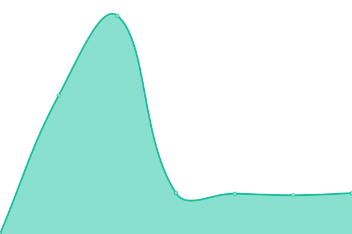 5660ms
     
 | 

<a href="https://bvenkysubbu.github.io/tymlymonitor/history/smd-altezz-block-a">95.28%</a>
    

|  [SMD Altezz Block B](https://cloud.tymly.in/status/1176) | 🟩 Up | [smd-altezz-block-b.yml](https://github.com/bvenkysubbu/tymlymonitor/commits/HEAD/history/smd-altezz-block-b.yml) | 

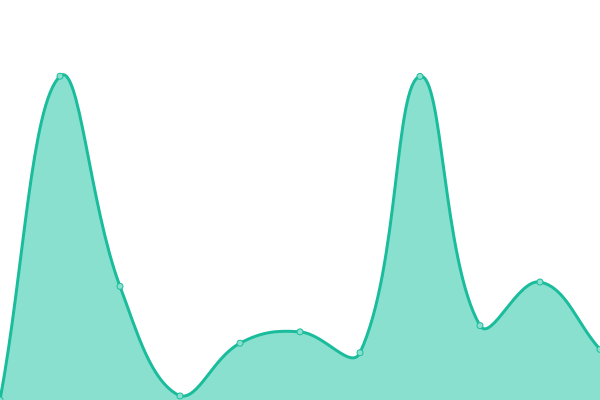 7397ms
     
 | 

<a href="https://bvenkysubbu.github.io/tymlymonitor/history/smd-altezz-block-b">95.05%</a>
    

|  [SMD Altezz Block C](https://cloud.tymly.in/status/1177) | 🟩 Up | [smd-altezz-block-c.yml](https://github.com/bvenkysubbu/tymlymonitor/commits/HEAD/history/smd-altezz-block-c.yml) | 

 8407ms
     
 | 

<a href="https://bvenkysubbu.github.io/tymlymonitor/history/smd-altezz-block-c">99.76%</a>
    

|  [SMD Altezz Clubhouse](https://cloud.tymly.in/status/1178) | 🟩 Up | [smd-altezz-clubhouse.yml](https://github.com/bvenkysubbu/tymlymonitor/commits/HEAD/history/smd-altezz-clubhouse.yml) | 

 7601ms
     
 | 

<a href="https://bvenkysubbu.github.io/tymlymonitor/history/smd-altezz-clubhouse">99.77%</a>
    

|  [SMD Altezz Block A Basement](https://cloud.tymly.in/status/1205) | 🟩 Up | [smd-altezz-block-a-basement.yml](https://github.com/bvenkysubbu/tymlymonitor/commits/HEAD/history/smd-altezz-block-a-basement.yml) | 

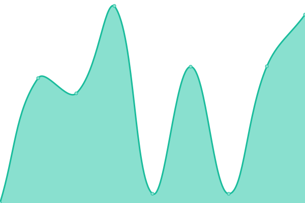 2579ms
     
 | 

<a href="https://bvenkysubbu.github.io/tymlymonitor/history/smd-altezz-block-a-basement">95.28%</a>
    

|  [SMD Altezz Block B Basement](https://cloud.tymly.in/status/1204) | 🟩 Up | [smd-altezz-block-b-basement.yml](https://github.com/bvenkysubbu/tymlymonitor/commits/HEAD/history/smd-altezz-block-b-basement.yml) | 

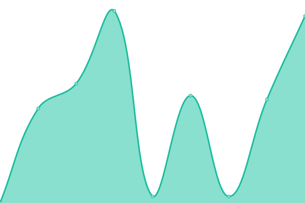 5298ms
     
 | 

<a href="https://bvenkysubbu.github.io/tymlymonitor/history/smd-altezz-block-b-basement">95.28%</a>
    

|  [SMD Altezz Block C Basement](https://cloud.tymly.in/status/1203) | 🟩 Up | [smd-altezz-block-c-basement.yml](https://github.com/bvenkysubbu/tymlymonitor/commits/HEAD/history/smd-altezz-block-c-basement.yml) | 

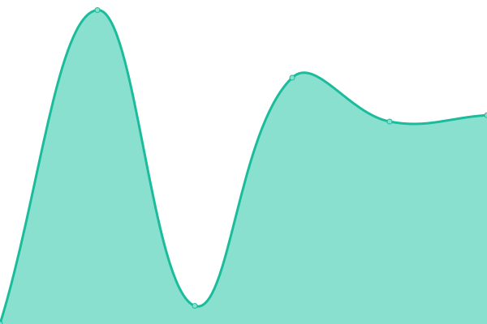 5023ms
     
 | 

<a href="https://bvenkysubbu.github.io/tymlymonitor/history/smd-altezz-block-c-basement">99.92%</a>
    

|  [Prestige Jade Pavilion Tower 1](https://cloud.tymly.in/status/1172) | 🟩 Up | [prestige-jade-pavilion-tower-1.yml](https://github.com/bvenkysubbu/tymlymonitor/commits/HEAD/history/prestige-jade-pavilion-tower-1.yml) | 

 4943ms
     
 | 

<a href="https://bvenkysubbu.github.io/tymlymonitor/history/prestige-jade-pavilion-tower-1">99.53%</a>
    

|  [Prestige Jade Pavilion Tower 2](https://cloud.tymly.in/status/1173) | 🟥 Down | [prestige-jade-pavilion-tower-2.yml](https://github.com/bvenkysubbu/tymlymonitor/commits/HEAD/history/prestige-jade-pavilion-tower-2.yml) | 

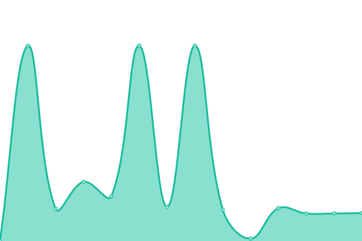 3840ms
     
 | 

<a href="https://bvenkysubbu.github.io/tymlymonitor/history/prestige-jade-pavilion-tower-2">64.00%</a>
    

|  [Prestige Jade Pavilion Tower 3](https://cloud.tymly.in/status/1171) | 🟩 Up | [prestige-jade-pavilion-tower-3.yml](https://github.com/bvenkysubbu/tymlymonitor/commits/HEAD/history/prestige-jade-pavilion-tower-3.yml) | 

 2609ms
     
 | 

<a href="https://bvenkysubbu.github.io/tymlymonitor/history/prestige-jade-pavilion-tower-3">100.00%</a>
    

|  [Prestige Jade Pavilion Tower 4](https://cloud.tymly.in/status/1170) | 🟩 Up | [prestige-jade-pavilion-tower-4.yml](https://github.com/bvenkysubbu/tymlymonitor/commits/HEAD/history/prestige-jade-pavilion-tower-4.yml) | 

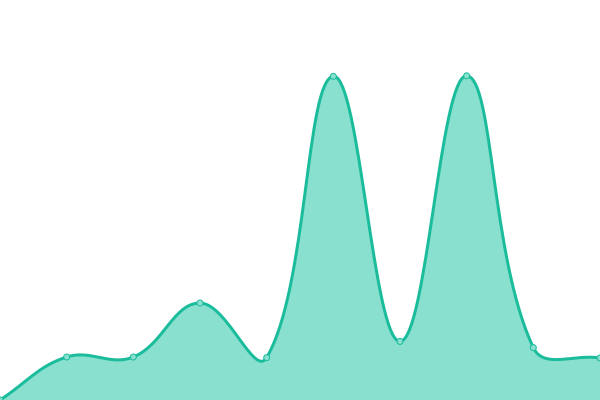 2941ms
     
 | 

<a href="https://bvenkysubbu.github.io/tymlymonitor/history/prestige-jade-pavilion-tower-4">100.00%</a>
    

|  [Trifecta Esplanade Clubhouse](https://cloud.tymly.in/status/1167) | 🟩 Up | [trifecta-esplanade-clubhouse.yml](https://github.com/bvenkysubbu/tymlymonitor/commits/HEAD/history/trifecta-esplanade-clubhouse.yml) | 

 8223ms
     
 | 

<a href="https://bvenkysubbu.github.io/tymlymonitor/history/trifecta-esplanade-clubhouse">99.71%</a>
    

|  [Trifecta Esplanade Security](https://cloud.tymly.in/status/1168) | 🟩 Up | [trifecta-esplanade-security.yml](https://github.com/bvenkysubbu/tymlymonitor/commits/HEAD/history/trifecta-esplanade-security.yml) | 

 5247ms
     
 | 

<a href="https://bvenkysubbu.github.io/tymlymonitor/history/trifecta-esplanade-security">83.15%</a>
    

|  [Trifecta Esplanade Multipurpose Hall](https://cloud.tymly.in/status/1169) | 🟩 Up | [trifecta-esplanade-multipurpose-hall.yml](https://github.com/bvenkysubbu/tymlymonitor/commits/HEAD/history/trifecta-esplanade-multipurpose-hall.yml) | 

 11635ms
     
 | 

<a href="https://bvenkysubbu.github.io/tymlymonitor/history/trifecta-esplanade-multipurpose-hall">100.00%</a>
    

|  [Casa Gopalan Block B Lift](https://cloud.tymly.in/status/1005) | 🟩 Up | [casa-gopalan-block-b-lift.yml](https://github.com/bvenkysubbu/tymlymonitor/commits/HEAD/history/casa-gopalan-block-b-lift.yml) | 

 5181ms
     
 | 

<a href="https://bvenkysubbu.github.io/tymlymonitor/history/casa-gopalan-block-b-lift">87.02%</a>
    

|  [Casa Gopalan Block A Lift](https://cloud.tymly.in/status/1006) | 🟩 Up | [casa-gopalan-block-a-lift.yml](https://github.com/bvenkysubbu/tymlymonitor/commits/HEAD/history/casa-gopalan-block-a-lift.yml) | 

 3770ms
     
 | 

<a href="https://bvenkysubbu.github.io/tymlymonitor/history/casa-gopalan-block-a-lift">87.03%</a>
    

|  [Casa Gopalan Basement 2](https://cloud.tymly.in/status/1190) | 🟩 Up | [casa-gopalan-basement-2.yml](https://github.com/bvenkysubbu/tymlymonitor/commits/HEAD/history/casa-gopalan-basement-2.yml) | 

 3645ms
     
 | 

<a href="https://bvenkysubbu.github.io/tymlymonitor/history/casa-gopalan-basement-2">87.04%</a>
    

|  [Casa Gopalan Block B Ground Floor](https://cloud.tymly.in/status/1191) | 🟩 Up | [casa-gopalan-block-b-ground-floor.yml](https://github.com/bvenkysubbu/tymlymonitor/commits/HEAD/history/casa-gopalan-block-b-ground-floor.yml) | 

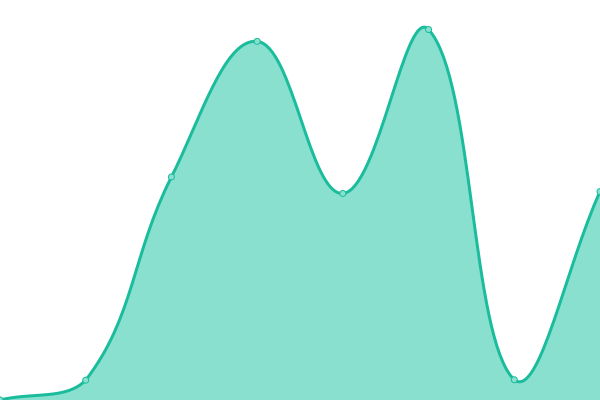 3515ms
     
 | 

<a href="https://bvenkysubbu.github.io/tymlymonitor/history/casa-gopalan-block-b-ground-floor">87.05%</a>
    

|  [Casa Gopalan Block A Ground Floor](https://cloud.tymly.in/status/1206) | 🟩 Up | [casa-gopalan-block-a-ground-floor.yml](https://github.com/bvenkysubbu/tymlymonitor/commits/HEAD/history/casa-gopalan-block-a-ground-floor.yml) | 

 1918ms
     
 | 

<a href="https://bvenkysubbu.github.io/tymlymonitor/history/casa-gopalan-block-a-ground-floor">87.04%</a>
    

|  [Amrutha Value](https://cloud.tymly.in/status/1010) | 🟥 Down | [amrutha-value.yml](https://github.com/bvenkysubbu/tymlymonitor/commits/HEAD/history/amrutha-value.yml) | 

 604ms
     
 | 

<a href="https://bvenkysubbu.github.io/tymlymonitor/history/amrutha-value">0.00%</a>
    

|  [Sterling Shalom C Block](https://cloud.tymly.in/status/1011) | 🟩 Up | [sterling-shalom-c-block.yml](https://github.com/bvenkysubbu/tymlymonitor/commits/HEAD/history/sterling-shalom-c-block.yml) | 

 6604ms
     
 | 

<a href="https://bvenkysubbu.github.io/tymlymonitor/history/sterling-shalom-c-block">14.08%</a>
    

|  [Sterling Shalom D Block](https://cloud.tymly.in/status/1012) | 🟩 Up | [sterling-shalom-d-block.yml](https://github.com/bvenkysubbu/tymlymonitor/commits/HEAD/history/sterling-shalom-d-block.yml) | 

 6571ms
     
 | 

<a href="https://bvenkysubbu.github.io/tymlymonitor/history/sterling-shalom-d-block">14.08%</a>
    

|  [Sterling Shalom F Block](https://cloud.tymly.in/status/1013) | 🟩 Up | [sterling-shalom-f-block.yml](https://github.com/bvenkysubbu/tymlymonitor/commits/HEAD/history/sterling-shalom-f-block.yml) | 

 7893ms
     
 | 

<a href="https://bvenkysubbu.github.io/tymlymonitor/history/sterling-shalom-f-block">86.72%</a>
    

|  [Sai Raghavendras Bloomfields](https://cloud.tymly.in/status/1014) | 🟩 Up | [sai-raghavendras-bloomfields.yml](https://github.com/bvenkysubbu/tymlymonitor/commits/HEAD/history/sai-raghavendras-bloomfields.yml) | 

 4448ms
     
 | 

<a href="https://bvenkysubbu.github.io/tymlymonitor/history/sai-raghavendras-bloomfields">0.00%</a>
    

|  [Amrutha Sarovar](https://cloud.tymly.in/status/1016) | 🟩 Up | [amrutha-sarovar.yml](https://github.com/bvenkysubbu/tymlymonitor/commits/HEAD/history/amrutha-sarovar.yml) | 

 5197ms
     
 | 

<a href="https://bvenkysubbu.github.io/tymlymonitor/history/amrutha-sarovar">99.74%</a>
    

|  [SBB Touchstone B Block](https://cloud.tymly.in/status/1018) | 🟩 Up | [sbb-touchstone-b-block.yml](https://github.com/bvenkysubbu/tymlymonitor/commits/HEAD/history/sbb-touchstone-b-block.yml) | 

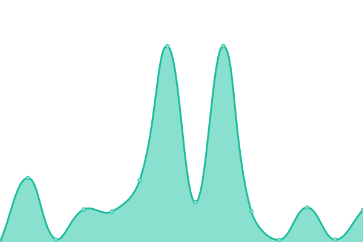 2525ms
     
 | 

<a href="https://bvenkysubbu.github.io/tymlymonitor/history/sbb-touchstone-b-block">43.25%</a>
    

|  [SBB Touchstone C Block](https://cloud.tymly.in/status/1184) | 🟩 Up | [sbb-touchstone-c-block.yml](https://github.com/bvenkysubbu/tymlymonitor/commits/HEAD/history/sbb-touchstone-c-block.yml) | 

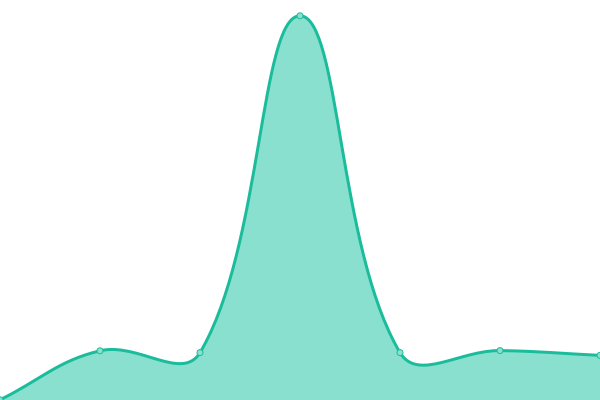 8189ms
     
 | 

<a href="https://bvenkysubbu.github.io/tymlymonitor/history/sbb-touchstone-c-block">99.58%</a>
    

|  [SBB Touchstone D Block](https://cloud.tymly.in/status/1185) | 🟩 Up | [sbb-touchstone-d-block.yml](https://github.com/bvenkysubbu/tymlymonitor/commits/HEAD/history/sbb-touchstone-d-block.yml) | 

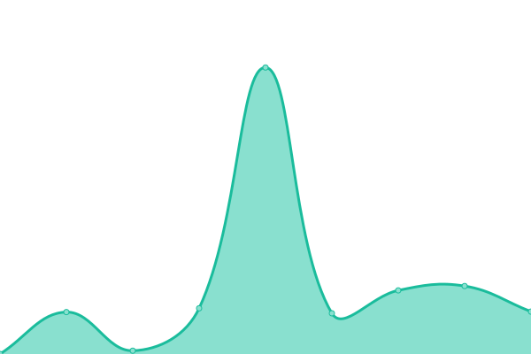 5339ms
     
 | 

<a href="https://bvenkysubbu.github.io/tymlymonitor/history/sbb-touchstone-d-block">99.60%</a>
    

|  [SBB Touchstone A1 Block](https://cloud.tymly.in/status/1186) | 🟩 Up | [sbb-touchstone-a1-block.yml](https://github.com/bvenkysubbu/tymlymonitor/commits/HEAD/history/sbb-touchstone-a1-block.yml) | 

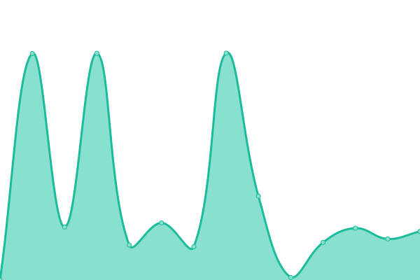 2475ms
     
 | 

<a href="https://bvenkysubbu.github.io/tymlymonitor/history/sbb-touchstone-a1-block">43.25%</a>
    

|  [SBB Touchstone A2 Block](https://cloud.tymly.in/status/1187) | 🟩 Up | [sbb-touchstone-a2-block.yml](https://github.com/bvenkysubbu/tymlymonitor/commits/HEAD/history/sbb-touchstone-a2-block.yml) | 

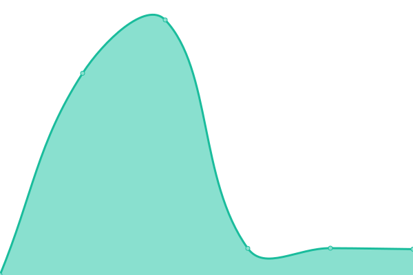 7684ms
     
 | 

<a href="https://bvenkysubbu.github.io/tymlymonitor/history/sbb-touchstone-a2-block">99.60%</a>
    

|  [United Elysium](https://cloud.tymly.in/status/1019) | 🟩 Up | [united-elysium.yml](https://github.com/bvenkysubbu/tymlymonitor/commits/HEAD/history/united-elysium.yml) | 

 5797ms
     
 | 

<a href="https://bvenkysubbu.github.io/tymlymonitor/history/united-elysium">65.33%</a>
    

|  [Greenville Whitefield](https://cloud.tymly.in/status/1020) | 🟩 Up | [greenville-whitefield.yml](https://github.com/bvenkysubbu/tymlymonitor/commits/HEAD/history/greenville-whitefield.yml) | 

 5654ms
     
 | 

<a href="https://bvenkysubbu.github.io/tymlymonitor/history/greenville-whitefield">96.97%</a>
    

|  [Nitesh Forest Hills and Flush Meadows](https://cloud.tymly.in/status/1023) | 🟩 Up | [nitesh-forest-hills-and-flush-meadows.yml](https://github.com/bvenkysubbu/tymlymonitor/commits/HEAD/history/nitesh-forest-hills-and-flush-meadows.yml) | 

 3193ms
     
 | 

<a href="https://bvenkysubbu.github.io/tymlymonitor/history/nitesh-forest-hills-and-flush-meadows">98.94%</a>
    

|  [Sterling Shalom A Block](https://cloud.tymly.in/status/1024) | 🟩 Up | [sterling-shalom-a-block.yml](https://github.com/bvenkysubbu/tymlymonitor/commits/HEAD/history/sterling-shalom-a-block.yml) | 

 5407ms
     
 | 

<a href="https://bvenkysubbu.github.io/tymlymonitor/history/sterling-shalom-a-block">99.10%</a>
    

|  [DSR Sunrise Towers](https://cloud.tymly.in/status/1025) | 🟩 Up | [dsr-sunrise-towers.yml](https://github.com/bvenkysubbu/tymlymonitor/commits/HEAD/history/dsr-sunrise-towers.yml) | 

 9029ms
     
 | 

<a href="https://bvenkysubbu.github.io/tymlymonitor/history/dsr-sunrise-towers">98.16%</a>
    

|  [United Elysium 2](https://cloud.tymly.in/status/1026) | 🟩 Up | [united-elysium-2.yml](https://github.com/bvenkysubbu/tymlymonitor/commits/HEAD/history/united-elysium-2.yml) | 

 5719ms
     
 | 

<a href="https://bvenkysubbu.github.io/tymlymonitor/history/united-elysium-2">68.74%</a>
    

|  [DSR Sunrise Towers 2](https://cloud.tymly.in/status/1027) | 🟩 Up | [dsr-sunrise-towers-2.yml](https://github.com/bvenkysubbu/tymlymonitor/commits/HEAD/history/dsr-sunrise-towers-2.yml) | 

 9092ms
     
 | 

<a href="https://bvenkysubbu.github.io/tymlymonitor/history/dsr-sunrise-towers-2">98.19%</a>
    

|  [Adithya Pristine KMC](https://cloud.tymly.in/status/1028) | 🟩 Up | [adithya-pristine-kmc.yml](https://github.com/bvenkysubbu/tymlymonitor/commits/HEAD/history/adithya-pristine-kmc.yml) | 

 6615ms
     
 | 

<a href="https://bvenkysubbu.github.io/tymlymonitor/history/adithya-pristine-kmc">98.73%</a>
    

|  [Sowparnika Ananda](https://cloud.tymly.in/status/1036) | 🟩 Up | [sowparnika-ananda.yml](https://github.com/bvenkysubbu/tymlymonitor/commits/HEAD/history/sowparnika-ananda.yml) | 

 5621ms
     
 | 

<a href="https://bvenkysubbu.github.io/tymlymonitor/history/sowparnika-ananda">98.59%</a>
    

|  [Wilson Vintage 1](https://cloud.tymly.in/status/1037) | 🟩 Up | [wilson-vintage-1.yml](https://github.com/bvenkysubbu/tymlymonitor/commits/HEAD/history/wilson-vintage-1.yml) | 

 5531ms
     
 | 

<a href="https://bvenkysubbu.github.io/tymlymonitor/history/wilson-vintage-1">0.00%</a>
    

|  [Wilson Vintage 2](https://cloud.tymly.in/status/1038) | 🟩 Up | [wilson-vintage-2.yml](https://github.com/bvenkysubbu/tymlymonitor/commits/HEAD/history/wilson-vintage-2.yml) | 

 4674ms
     
 | 

<a href="https://bvenkysubbu.github.io/tymlymonitor/history/wilson-vintage-2">6.39%</a>
    

|  [SNR Silver Ripples](https://cloud.tymly.in/status/1039) | 🟥 Down | [snr-silver-ripples.yml](https://github.com/bvenkysubbu/tymlymonitor/commits/HEAD/history/snr-silver-ripples.yml) | 

 7599ms
     
 | 

<a href="https://bvenkysubbu.github.io/tymlymonitor/history/snr-silver-ripples">54.09%</a>
    

|  [SNR Silver Ripples 2](https://cloud.tymly.in/status/1040) | 🟩 Up | [snr-silver-ripples-2.yml](https://github.com/bvenkysubbu/tymlymonitor/commits/HEAD/history/snr-silver-ripples-2.yml) | 

 6822ms
     
 | 

<a href="https://bvenkysubbu.github.io/tymlymonitor/history/snr-silver-ripples-2">82.04%</a>
    

|  [Adarsh Vihar](https://cloud.tymly.in/status/1041) | 🟩 Up | [adarsh-vihar.yml](https://github.com/bvenkysubbu/tymlymonitor/commits/HEAD/history/adarsh-vihar.yml) | 

 4775ms
     
 | 

<a href="https://bvenkysubbu.github.io/tymlymonitor/history/adarsh-vihar">60.50%</a>
    

|  [Urban Greens](https://cloud.tymly.in/status/1046) | 🟩 Up | [urban-greens.yml](https://github.com/bvenkysubbu/tymlymonitor/commits/HEAD/history/urban-greens.yml) | 

 6261ms
     
 | 

<a href="https://bvenkysubbu.github.io/tymlymonitor/history/urban-greens">100.00%</a>
    

|  [Nitesh Flushing Meadows Block B](https://cloud.tymly.in/status/1047) | 🟩 Up | [nitesh-flushing-meadows-block-b.yml](https://github.com/bvenkysubbu/tymlymonitor/commits/HEAD/history/nitesh-flushing-meadows-block-b.yml) | 

 11007ms
     
 | 

<a href="https://bvenkysubbu.github.io/tymlymonitor/history/nitesh-flushing-meadows-block-b">83.84%</a>
    

|  [Ruchira Lilium v2](https://cloud.tymly.in/status/1048) | 🟩 Up | [ruchira-lilium-v2.yml](https://github.com/bvenkysubbu/tymlymonitor/commits/HEAD/history/ruchira-lilium-v2.yml) | 

 7047ms
     
 | 

<a href="https://bvenkysubbu.github.io/tymlymonitor/history/ruchira-lilium-v2">97.85%</a>
    

|  [Nitesh Flushing Meadows Block D](https://cloud.tymly.in/status/1049) | 🟩 Up | [nitesh-flushing-meadows-block-d.yml](https://github.com/bvenkysubbu/tymlymonitor/commits/HEAD/history/nitesh-flushing-meadows-block-d.yml) | 

 10853ms
     
 | 

<a href="https://bvenkysubbu.github.io/tymlymonitor/history/nitesh-flushing-meadows-block-d">76.07%</a>
    

|  [Nitesh Forest Hills Block C](https://cloud.tymly.in/status/1050) | 🟩 Up | [nitesh-forest-hills-block-c.yml](https://github.com/bvenkysubbu/tymlymonitor/commits/HEAD/history/nitesh-forest-hills-block-c.yml) | 

 4902ms
     
 | 

<a href="https://bvenkysubbu.github.io/tymlymonitor/history/nitesh-forest-hills-block-c">82.78%</a>
    

|  [Nitesh Forest Hills Block B](https://cloud.tymly.in/status/1051) | 🟩 Up | [nitesh-forest-hills-block-b.yml](https://github.com/bvenkysubbu/tymlymonitor/commits/HEAD/history/nitesh-forest-hills-block-b.yml) | 

 3882ms
     
 | 

<a href="https://bvenkysubbu.github.io/tymlymonitor/history/nitesh-forest-hills-block-b">82.60%</a>
    

|  [Nitesh Forest Hills Block A](https://cloud.tymly.in/status/1052) | 🟩 Up | [nitesh-forest-hills-block-a.yml](https://github.com/bvenkysubbu/tymlymonitor/commits/HEAD/history/nitesh-forest-hills-block-a.yml) | 

 3754ms
     
 | 

<a href="https://bvenkysubbu.github.io/tymlymonitor/history/nitesh-forest-hills-block-a">82.80%</a>
    

|  [Nitesh Flushing Meadows Block A](https://cloud.tymly.in/status/1053) | 🟩 Up | [nitesh-flushing-meadows-block-a.yml](https://github.com/bvenkysubbu/tymlymonitor/commits/HEAD/history/nitesh-flushing-meadows-block-a.yml) | 

 10739ms
     
 | 

<a href="https://bvenkysubbu.github.io/tymlymonitor/history/nitesh-flushing-meadows-block-a">70.30%</a>
    

|  [Nitesh Flushing Meadows Block C](https://cloud.tymly.in/status/1054) | 🟩 Up | [nitesh-flushing-meadows-block-c.yml](https://github.com/bvenkysubbu/tymlymonitor/commits/HEAD/history/nitesh-flushing-meadows-block-c.yml) | 

 9702ms
     
 | 

<a href="https://bvenkysubbu.github.io/tymlymonitor/history/nitesh-flushing-meadows-block-c">59.73%</a>
    

|  [Prakruthi Villas Sarjapura](https://cloud.tymly.in/status/1058) | 🟩 Up | [prakruthi-villas-sarjapura.yml](https://github.com/bvenkysubbu/tymlymonitor/commits/HEAD/history/prakruthi-villas-sarjapura.yml) | 

 7944ms
     
 | 

<a href="https://bvenkysubbu.github.io/tymlymonitor/history/prakruthi-villas-sarjapura">84.52%</a>
    

|  [Sowparnika Ananda D Block](https://cloud.tymly.in/status/1061) | 🟩 Up | [sowparnika-ananda-d-block.yml](https://github.com/bvenkysubbu/tymlymonitor/commits/HEAD/history/sowparnika-ananda-d-block.yml) | 

 3646ms
     
 | 

<a href="https://bvenkysubbu.github.io/tymlymonitor/history/sowparnika-ananda-d-block">100.00%</a>
    

|  [Sai Gardens](https://cloud.tymly.in/status/1066) | 🟩 Up | [sai-gardens.yml](https://github.com/bvenkysubbu/tymlymonitor/commits/HEAD/history/sai-gardens.yml) | 

 4010ms
     
 | 

<a href="https://bvenkysubbu.github.io/tymlymonitor/history/sai-gardens">100.00%</a>
    

|  [Sai Gardens Community Hall](https://cloud.tymly.in/status/1073) | 🟩 Up | [sai-gardens-community-hall.yml](https://github.com/bvenkysubbu/tymlymonitor/commits/HEAD/history/sai-gardens-community-hall.yml) | 

 4168ms
     
 | 

<a href="https://bvenkysubbu.github.io/tymlymonitor/history/sai-gardens-community-hall">100.00%</a>
    

|  [Sai Gardens Temple Side](https://cloud.tymly.in/status/1074) | 🟩 Up | [sai-gardens-temple-side.yml](https://github.com/bvenkysubbu/tymlymonitor/commits/HEAD/history/sai-gardens-temple-side.yml) | 

 663ms
     
 | 

<a href="https://bvenkysubbu.github.io/tymlymonitor/history/sai-gardens-temple-side">100.00%</a>
    

|  [Sai Gardens Shanthi II](https://cloud.tymly.in/status/1193) | 🟩 Up | [sai-gardens-shanthi-ii.yml](https://github.com/bvenkysubbu/tymlymonitor/commits/HEAD/history/sai-gardens-shanthi-ii.yml) | 

 6930ms
     
 | 

<a href="https://bvenkysubbu.github.io/tymlymonitor/history/sai-gardens-shanthi-ii">100.00%</a>
    

|  [Sai Gardens Dharma 8](https://cloud.tymly.in/status/1194) | 🟩 Up | [sai-gardens-dharma-8.yml](https://github.com/bvenkysubbu/tymlymonitor/commits/HEAD/history/sai-gardens-dharma-8.yml) | 

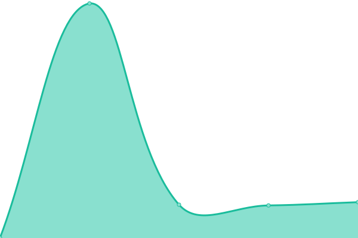 612ms
     
 | 

<a href="https://bvenkysubbu.github.io/tymlymonitor/history/sai-gardens-dharma-8">100.00%</a>
    

|  [Sai Gardens Prema 2](https://cloud.tymly.in/status/1195) | 🟩 Up | [sai-gardens-prema-2.yml](https://github.com/bvenkysubbu/tymlymonitor/commits/HEAD/history/sai-gardens-prema-2.yml) | 

 678ms
     
 | 

<a href="https://bvenkysubbu.github.io/tymlymonitor/history/sai-gardens-prema-2">100.00%</a>
    

|  [Sai Gardens Sathya 2](https://cloud.tymly.in/status/1196) | 🟩 Up | [sai-gardens-sathya-2.yml](https://github.com/bvenkysubbu/tymlymonitor/commits/HEAD/history/sai-gardens-sathya-2.yml) | 

 239ms
     
 | 

<a href="https://bvenkysubbu.github.io/tymlymonitor/history/sai-gardens-sathya-2">100.00%</a>
    

|  [Sai Gardens Sathya 5](https://cloud.tymly.in/status/1197) | 🟩 Up | [sai-gardens-sathya-5.yml](https://github.com/bvenkysubbu/tymlymonitor/commits/HEAD/history/sai-gardens-sathya-5.yml) | 

 612ms
     
 | 

<a href="https://bvenkysubbu.github.io/tymlymonitor/history/sai-gardens-sathya-5">100.00%</a>
    

|  [Sai Gardens Shanthi 3](https://cloud.tymly.in/status/1198) | 🟩 Up | [sai-gardens-shanthi-3.yml](https://github.com/bvenkysubbu/tymlymonitor/commits/HEAD/history/sai-gardens-shanthi-3.yml) | 

 238ms
     
 | 

<a href="https://bvenkysubbu.github.io/tymlymonitor/history/sai-gardens-shanthi-3">100.00%</a>
    

|  [Sai Gardens Dharma 5](https://cloud.tymly.in/status/1199) | 🟩 Up | [sai-gardens-dharma-5.yml](https://github.com/bvenkysubbu/tymlymonitor/commits/HEAD/history/sai-gardens-dharma-5.yml) | 

 685ms
     
 | 

<a href="https://bvenkysubbu.github.io/tymlymonitor/history/sai-gardens-dharma-5">100.00%</a>
    

|  [Sai Gardens Dharma 2](https://cloud.tymly.in/status/1200) | 🟩 Up | [sai-gardens-dharma-2.yml](https://github.com/bvenkysubbu/tymlymonitor/commits/HEAD/history/sai-gardens-dharma-2.yml) | 

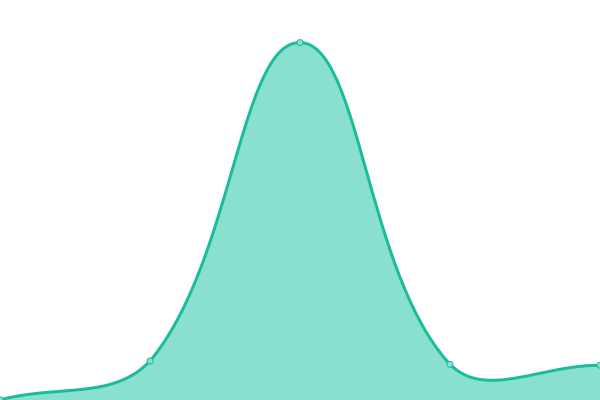 640ms
     
 | 

<a href="https://bvenkysubbu.github.io/tymlymonitor/history/sai-gardens-dharma-2">100.00%</a>
    

|  [Sai Gardens Sathya 6](https://cloud.tymly.in/status/1202) | 🟩 Up | [sai-gardens-sathya-6.yml](https://github.com/bvenkysubbu/tymlymonitor/commits/HEAD/history/sai-gardens-sathya-6.yml) | 

 669ms
     
 | 

<a href="https://bvenkysubbu.github.io/tymlymonitor/history/sai-gardens-sathya-6">100.00%</a>
    

|  [Hinduja Park 1](https://cloud.tymly.in/status/1067) | 🟩 Up | [hinduja-park-1.yml](https://github.com/bvenkysubbu/tymlymonitor/commits/HEAD/history/hinduja-park-1.yml) | 

 6707ms
     
 | 

<a href="https://bvenkysubbu.github.io/tymlymonitor/history/hinduja-park-1">100.00%</a>
    

|  [Sterling Villa Grande](https://cloud.tymly.in/status/1068) | 🟥 Down | [sterling-villa-grande.yml](https://github.com/bvenkysubbu/tymlymonitor/commits/HEAD/history/sterling-villa-grande.yml) | 

 638ms
     
 | 

<a href="https://bvenkysubbu.github.io/tymlymonitor/history/sterling-villa-grande">0.00%</a>
    

|  [Sterling Shalom B Block](https://cloud.tymly.in/status/1069) | 🟩 Up | [sterling-shalom-b-block.yml](https://github.com/bvenkysubbu/tymlymonitor/commits/HEAD/history/sterling-shalom-b-block.yml) | 

 6466ms
     
 | 

<a href="https://bvenkysubbu.github.io/tymlymonitor/history/sterling-shalom-b-block">99.72%</a>
    

|  [Sterling Shalom E Block](https://cloud.tymly.in/status/1070) | 🟩 Up | [sterling-shalom-e-block.yml](https://github.com/bvenkysubbu/tymlymonitor/commits/HEAD/history/sterling-shalom-e-block.yml) | 

 4069ms
     
 | 

<a href="https://bvenkysubbu.github.io/tymlymonitor/history/sterling-shalom-e-block">100.00%</a>
    

|  [Mahaveer Varna A1](https://cloud.tymly.in/status/1083) | 🟩 Up | [mahaveer-varna-a1.yml](https://github.com/bvenkysubbu/tymlymonitor/commits/HEAD/history/mahaveer-varna-a1.yml) | 

 7223ms
     
 | 

<a href="https://bvenkysubbu.github.io/tymlymonitor/history/mahaveer-varna-a1">88.46%</a>
    

|  [Mahaveer Varna A4](https://cloud.tymly.in/status/1084) | 🟩 Up | [mahaveer-varna-a4.yml](https://github.com/bvenkysubbu/tymlymonitor/commits/HEAD/history/mahaveer-varna-a4.yml) | 

 6446ms
     
 | 

<a href="https://bvenkysubbu.github.io/tymlymonitor/history/mahaveer-varna-a4">95.00%</a>
    

|  [Mahaveer Varna B1](https://cloud.tymly.in/status/1085) | 🟩 Up | [mahaveer-varna-b1.yml](https://github.com/bvenkysubbu/tymlymonitor/commits/HEAD/history/mahaveer-varna-b1.yml) | 

 7357ms
     
 | 

<a href="https://bvenkysubbu.github.io/tymlymonitor/history/mahaveer-varna-b1">99.85%</a>
    

|  [Mahaveer Varna B3](https://cloud.tymly.in/status/1086) | 🟥 Down | [mahaveer-varna-b3.yml](https://github.com/bvenkysubbu/tymlymonitor/commits/HEAD/history/mahaveer-varna-b3.yml) | 

 5899ms
     
 | 

<a href="https://bvenkysubbu.github.io/tymlymonitor/history/mahaveer-varna-b3">27.92%</a>
    

|  [Sumadhura Silver Ripples Club House](https://cloud.tymly.in/status/1090) | 🟩 Up | [sumadhura-silver-ripples-club-house.yml](https://github.com/bvenkysubbu/tymlymonitor/commits/HEAD/history/sumadhura-silver-ripples-club-house.yml) | 

 8536ms
     
 | 

<a href="https://bvenkysubbu.github.io/tymlymonitor/history/sumadhura-silver-ripples-club-house">99.54%</a>
    

|  [SMR Vinay Cascade B Block](https://cloud.tymly.in/status/1093) | 🟥 Down | [smr-vinay-cascade-b-block.yml](https://github.com/bvenkysubbu/tymlymonitor/commits/HEAD/history/smr-vinay-cascade-b-block.yml) | 

 14976ms
     
 | 

<a href="https://bvenkysubbu.github.io/tymlymonitor/history/smr-vinay-cascade-b-block">75.83%</a>
    

|  [SMR Vinay Cascade A Block](https://cloud.tymly.in/status/1094) | 🟥 Down | [smr-vinay-cascade-a-block.yml](https://github.com/bvenkysubbu/tymlymonitor/commits/HEAD/history/smr-vinay-cascade-a-block.yml) | 

 12426ms
     
 | 

<a href="https://bvenkysubbu.github.io/tymlymonitor/history/smr-vinay-cascade-a-block">28.46%</a>
    

|  [Whitestone Landmark](https://cloud.tymly.in/status/1095) | 🟩 Up | [whitestone-landmark.yml](https://github.com/bvenkysubbu/tymlymonitor/commits/HEAD/history/whitestone-landmark.yml) | 

 9218ms
     
 | 

<a href="https://bvenkysubbu.github.io/tymlymonitor/history/whitestone-landmark">99.23%</a>
    

|  [Whitestone Landmark Block A](https://cloud.tymly.in/status/1192) | 🟩 Up | [whitestone-landmark-block-a.yml](https://github.com/bvenkysubbu/tymlymonitor/commits/HEAD/history/whitestone-landmark-block-a.yml) | 

 7941ms
     
 | 

<a href="https://bvenkysubbu.github.io/tymlymonitor/history/whitestone-landmark-block-a">99.02%</a>
    

|  [White Breeze 1](https://cloud.tymly.in/status/1096) | 🟩 Up | [white-breeze-1.yml](https://github.com/bvenkysubbu/tymlymonitor/commits/HEAD/history/white-breeze-1.yml) | 

 5748ms
     
 | 

<a href="https://bvenkysubbu.github.io/tymlymonitor/history/white-breeze-1">82.25%</a>
    

|  [White Breeze 2](https://cloud.tymly.in/status/1097) | 🟩 Up | [white-breeze-2.yml](https://github.com/bvenkysubbu/tymlymonitor/commits/HEAD/history/white-breeze-2.yml) | 

 3786ms
     
 | 

<a href="https://bvenkysubbu.github.io/tymlymonitor/history/white-breeze-2">82.25%</a>
    

|  [VBHC Serene Town A Block](https://cloud.tymly.in/status/1129) | 🟩 Up | [vbhc-serene-town-a-block.yml](https://github.com/bvenkysubbu/tymlymonitor/commits/HEAD/history/vbhc-serene-town-a-block.yml) | 

 8079ms
     
 | 

<a href="https://bvenkysubbu.github.io/tymlymonitor/history/vbhc-serene-town-a-block">87.24%</a>
    

|  [VBHC Serene Town B Block](https://cloud.tymly.in/status/1130) | 🟩 Up | [vbhc-serene-town-b-block.yml](https://github.com/bvenkysubbu/tymlymonitor/commits/HEAD/history/vbhc-serene-town-b-block.yml) | 

 9653ms
     
 | 

<a href="https://bvenkysubbu.github.io/tymlymonitor/history/vbhc-serene-town-b-block">100.00%</a>
    

|  [VBHC Serene Town D Block](https://cloud.tymly.in/status/1131) | 🟩 Up | [vbhc-serene-town-d-block.yml](https://github.com/bvenkysubbu/tymlymonitor/commits/HEAD/history/vbhc-serene-town-d-block.yml) | 

 7720ms
     
 | 

<a href="https://bvenkysubbu.github.io/tymlymonitor/history/vbhc-serene-town-d-block">100.00%</a>
    

|  [VBHC Serene Town C Block](https://cloud.tymly.in/status/1132) | 🟩 Up | [vbhc-serene-town-c-block.yml](https://github.com/bvenkysubbu/tymlymonitor/commits/HEAD/history/vbhc-serene-town-c-block.yml) | 

 15600ms
     
 | 

<a href="https://bvenkysubbu.github.io/tymlymonitor/history/vbhc-serene-town-c-block">19.45%</a>
    

|  [Desai Grandeur 1](https://cloud.tymly.in/status/1133) | 🟩 Up | [desai-grandeur-1.yml](https://github.com/bvenkysubbu/tymlymonitor/commits/HEAD/history/desai-grandeur-1.yml) | 

 8648ms
     
 | 

<a href="https://bvenkysubbu.github.io/tymlymonitor/history/desai-grandeur-1">49.75%</a>
    

|  [Desai Grandeur 2](https://cloud.tymly.in/status/1134) | 🟩 Up | [desai-grandeur-2.yml](https://github.com/bvenkysubbu/tymlymonitor/commits/HEAD/history/desai-grandeur-2.yml) | 

 9210ms
     
 | 

<a href="https://bvenkysubbu.github.io/tymlymonitor/history/desai-grandeur-2">89.31%</a>
    

|  [Madhuban Brindavan A Block](https://cloud.tymly.in/status/1135) | 🟩 Up | [madhuban-brindavan-a-block.yml](https://github.com/bvenkysubbu/tymlymonitor/commits/HEAD/history/madhuban-brindavan-a-block.yml) | 

 3104ms
     
 | 

<a href="https://bvenkysubbu.github.io/tymlymonitor/history/madhuban-brindavan-a-block">99.21%</a>
    

|  [Madhuban Brindavan B Block](https://cloud.tymly.in/status/1136) | 🟩 Up | [madhuban-brindavan-b-block.yml](https://github.com/bvenkysubbu/tymlymonitor/commits/HEAD/history/madhuban-brindavan-b-block.yml) | 

 1989ms
     
 | 

<a href="https://bvenkysubbu.github.io/tymlymonitor/history/madhuban-brindavan-b-block">62.32%</a>
    

|  [Madhuban Brindavan 3 Block](https://cloud.tymly.in/status/1182) | 🟩 Up | [madhuban-brindavan-3-block.yml](https://github.com/bvenkysubbu/tymlymonitor/commits/HEAD/history/madhuban-brindavan-3-block.yml) | 

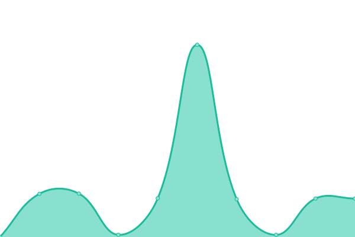 2552ms
     
 | 

<a href="https://bvenkysubbu.github.io/tymlymonitor/history/madhuban-brindavan-3-block">62.31%</a>
    

|  [Madhuban Brindavan 4 Block](https://cloud.tymly.in/status/1183) | 🟩 Up | [madhuban-brindavan-4-block.yml](https://github.com/bvenkysubbu/tymlymonitor/commits/HEAD/history/madhuban-brindavan-4-block.yml) | 

 3751ms
     
 | 

<a href="https://bvenkysubbu.github.io/tymlymonitor/history/madhuban-brindavan-4-block">99.13%</a>
    

|  [Dasta Concerto Entrance](https://cloud.tymly.in/status/1137) | 🟥 Down | [dasta-concerto-entrance.yml](https://github.com/bvenkysubbu/tymlymonitor/commits/HEAD/history/dasta-concerto-entrance.yml) | 

 9721ms
     
 | 

<a href="https://bvenkysubbu.github.io/tymlymonitor/history/dasta-concerto-entrance">97.09%</a>
    

|  [Dasta Concerto Basement](https://cloud.tymly.in/status/1138) | 🟩 Up | [dasta-concerto-basement.yml](https://github.com/bvenkysubbu/tymlymonitor/commits/HEAD/history/dasta-concerto-basement.yml) | 

 7749ms
     
 | 

<a href="https://bvenkysubbu.github.io/tymlymonitor/history/dasta-concerto-basement">98.12%</a>
    

|  [Dasta Concerto Basement 2](https://cloud.tymly.in/status/1188) | 🟩 Up | [dasta-concerto-basement-2.yml](https://github.com/bvenkysubbu/tymlymonitor/commits/HEAD/history/dasta-concerto-basement-2.yml) | 

 5478ms
     
 | 

<a href="https://bvenkysubbu.github.io/tymlymonitor/history/dasta-concerto-basement-2">93.26%</a>
    

|  [Dasta Concerto Clubhouse Gym](https://cloud.tymly.in/status/1189) | 🟩 Up | [dasta-concerto-clubhouse-gym.yml](https://github.com/bvenkysubbu/tymlymonitor/commits/HEAD/history/dasta-concerto-clubhouse-gym.yml) | 

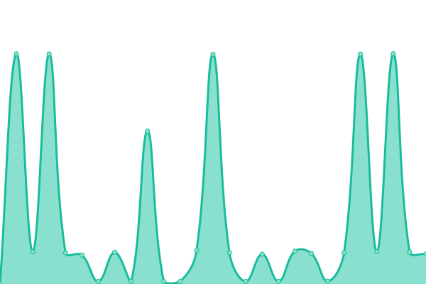 5003ms
     
 | 

<a href="https://bvenkysubbu.github.io/tymlymonitor/history/dasta-concerto-clubhouse-gym">78.67%</a>
    

|  [Amrutha Sarovar Office](https://cloud.tymly.in/status/1140) | 🟥 Down | [amrutha-sarovar-office.yml](https://github.com/bvenkysubbu/tymlymonitor/commits/HEAD/history/amrutha-sarovar-office.yml) | 

 4142ms
     
 | 

<a href="https://bvenkysubbu.github.io/tymlymonitor/history/amrutha-sarovar-office">39.19%</a>
    

|  [Brigade Cosmopolis Clubhouse Entrance](https://cloud.tymly.in/status/1141) | 🟩 Up | [brigade-cosmopolis-clubhouse-entrance.yml](https://github.com/bvenkysubbu/tymlymonitor/commits/HEAD/history/brigade-cosmopolis-clubhouse-entrance.yml) | 

 4031ms
     
 | 

<a href="https://bvenkysubbu.github.io/tymlymonitor/history/brigade-cosmopolis-clubhouse-entrance">100.00%</a>
    

|  [Brigade Cosmopolis Clubhouse End](https://cloud.tymly.in/status/1145) | 🟩 Up | [brigade-cosmopolis-clubhouse-end.yml](https://github.com/bvenkysubbu/tymlymonitor/commits/HEAD/history/brigade-cosmopolis-clubhouse-end.yml) | 

 7237ms
     
 | 

<a href="https://bvenkysubbu.github.io/tymlymonitor/history/brigade-cosmopolis-clubhouse-end">99.76%</a>
    

|  [Trifecta Esplanade A Block](https://cloud.tymly.in/status/1153) | 🟩 Up | [trifecta-esplanade-a-block.yml](https://github.com/bvenkysubbu/tymlymonitor/commits/HEAD/history/trifecta-esplanade-a-block.yml) | 

 9732ms
     
 | 

<a href="https://bvenkysubbu.github.io/tymlymonitor/history/trifecta-esplanade-a-block">98.88%</a>
    

|  [Trifecta Esplanade B Block](https://cloud.tymly.in/status/1154) | 🟩 Up | [trifecta-esplanade-b-block.yml](https://github.com/bvenkysubbu/tymlymonitor/commits/HEAD/history/trifecta-esplanade-b-block.yml) | 

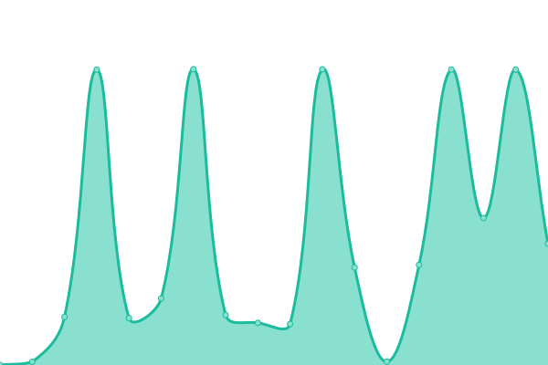 9059ms
     
 | 

<a href="https://bvenkysubbu.github.io/tymlymonitor/history/trifecta-esplanade-b-block">98.71%</a>
    

|  [Trifecta Esplanade C Block](https://cloud.tymly.in/status/1155) | 🟩 Up | [trifecta-esplanade-c-block.yml](https://github.com/bvenkysubbu/tymlymonitor/commits/HEAD/history/trifecta-esplanade-c-block.yml) | 

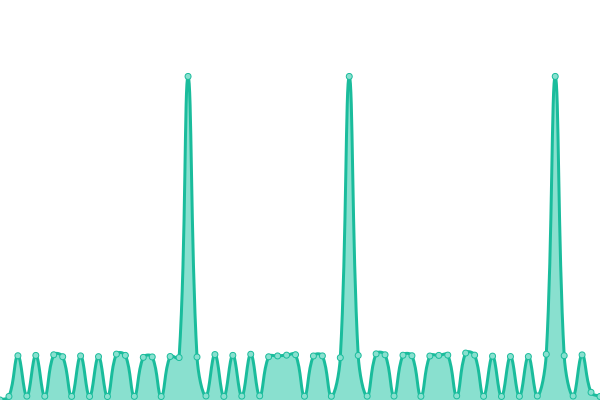 7070ms
     
 | 

<a href="https://bvenkysubbu.github.io/tymlymonitor/history/trifecta-esplanade-c-block">90.59%</a>
    

|  [Trifecta Esplanade D Block](https://cloud.tymly.in/status/1156) | 🟩 Up | [trifecta-esplanade-d-block.yml](https://github.com/bvenkysubbu/tymlymonitor/commits/HEAD/history/trifecta-esplanade-d-block.yml) | 

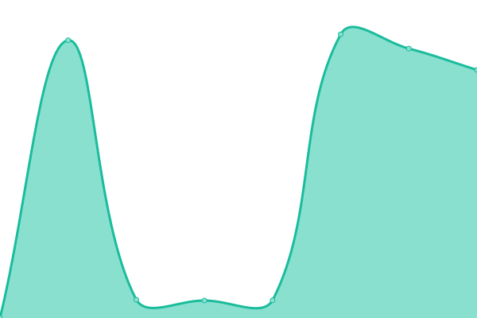 9464ms
     
 | 

<a href="https://bvenkysubbu.github.io/tymlymonitor/history/trifecta-esplanade-d-block">99.76%</a>
    

|  [Trifecta Esplanade E Block](https://cloud.tymly.in/status/1157) | 🟥 Down | [trifecta-esplanade-e-block.yml](https://github.com/bvenkysubbu/tymlymonitor/commits/HEAD/history/trifecta-esplanade-e-block.yml) | 

 235ms
     
 | 

<a href="https://bvenkysubbu.github.io/tymlymonitor/history/trifecta-esplanade-e-block">0.00%</a>
    

|  [Trifecta Esplanade F Block](https://cloud.tymly.in/status/1159) | 🟩 Up | [trifecta-esplanade-f-block.yml](https://github.com/bvenkysubbu/tymlymonitor/commits/HEAD/history/trifecta-esplanade-f-block.yml) | 

 7657ms
     
 | 

<a href="https://bvenkysubbu.github.io/tymlymonitor/history/trifecta-esplanade-f-block">88.70%</a>
    

|  [Trifecta Esplanade G Block](https://cloud.tymly.in/status/1158) | 🟥 Down | [trifecta-esplanade-g-block.yml](https://github.com/bvenkysubbu/tymlymonitor/commits/HEAD/history/trifecta-esplanade-g-block.yml) | 

 1431ms
     
 | 

<a href="https://bvenkysubbu.github.io/tymlymonitor/history/trifecta-esplanade-g-block">100.00%</a>
    

|  [Trifecta Esplanade H Block](https://cloud.tymly.in/status/1161) | 🟩 Up | [trifecta-esplanade-h-block.yml](https://github.com/bvenkysubbu/tymlymonitor/commits/HEAD/history/trifecta-esplanade-h-block.yml) | 

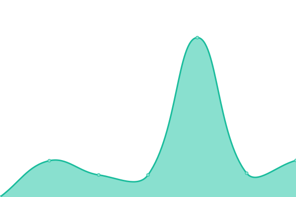 8673ms
     
 | 

<a href="https://bvenkysubbu.github.io/tymlymonitor/history/trifecta-esplanade-h-block">99.59%</a>
    

|  [Trifecta Esplanade I Block](https://cloud.tymly.in/status/1160) | 🟩 Up | [trifecta-esplanade-i-block.yml](https://github.com/bvenkysubbu/tymlymonitor/commits/HEAD/history/trifecta-esplanade-i-block.yml) | 

 8586ms
     
 | 

<a href="https://bvenkysubbu.github.io/tymlymonitor/history/trifecta-esplanade-i-block">99.61%</a>
    

|  [Trifecta Esplanade J Block](https://cloud.tymly.in/status/1162) | 🟩 Up | [trifecta-esplanade-j-block.yml](https://github.com/bvenkysubbu/tymlymonitor/commits/HEAD/history/trifecta-esplanade-j-block.yml) | 

 8636ms
     
 | 

<a href="https://bvenkysubbu.github.io/tymlymonitor/history/trifecta-esplanade-j-block">99.63%</a>
    

|  [Trifecta Esplanade K Block](https://cloud.tymly.in/status/1163) | 🟩 Up | [trifecta-esplanade-k-block.yml](https://github.com/bvenkysubbu/tymlymonitor/commits/HEAD/history/trifecta-esplanade-k-block.yml) | 

 6534ms
     
 | 

<a href="https://bvenkysubbu.github.io/tymlymonitor/history/trifecta-esplanade-k-block">81.71%</a>
    

|  [Trifecta Esplanade L Block](https://cloud.tymly.in/status/1164) | 🟩 Up | [trifecta-esplanade-l-block.yml](https://github.com/bvenkysubbu/tymlymonitor/commits/HEAD/history/trifecta-esplanade-l-block.yml) | 

 3078ms
     
 | 

<a href="https://bvenkysubbu.github.io/tymlymonitor/history/trifecta-esplanade-l-block">100.00%</a>
    

|  [Trifecta Esplanade M Block](https://cloud.tymly.in/status/1003) | 🟩 Up | [trifecta-esplanade-m-block.yml](https://github.com/bvenkysubbu/tymlymonitor/commits/HEAD/history/trifecta-esplanade-m-block.yml) | 

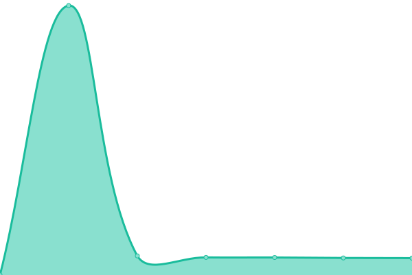 7005ms
     
 | 

<a href="https://bvenkysubbu.github.io/tymlymonitor/history/trifecta-esplanade-m-block">0.94%</a>
    

|  [Trifecta Esplanade N Block](https://cloud.tymly.in/status/1165) | 🟩 Up | [trifecta-esplanade-n-block.yml](https://github.com/bvenkysubbu/tymlymonitor/commits/HEAD/history/trifecta-esplanade-n-block.yml) | 

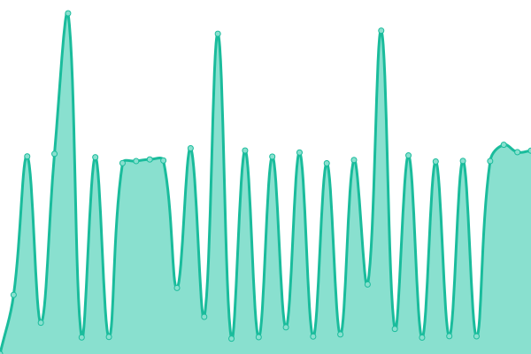 5179ms
     
 | 

<a href="https://bvenkysubbu.github.io/tymlymonitor/history/trifecta-esplanade-n-block">56.30%</a>
    

|  [Trifecta Esplanade O Block](https://cloud.tymly.in/status/1166) | 🟩 Up | [trifecta-esplanade-o-block.yml](https://github.com/bvenkysubbu/tymlymonitor/commits/HEAD/history/trifecta-esplanade-o-block.yml) | 

 9195ms
     
 | 

<a href="https://bvenkysubbu.github.io/tymlymonitor/history/trifecta-esplanade-o-block">87.20%</a>
    

|  [Trifecta Esplanade P Block](https://cloud.tymly.in/status/1017) | 🟩 Up | [trifecta-esplanade-p-block.yml](https://github.com/bvenkysubbu/tymlymonitor/commits/HEAD/history/trifecta-esplanade-p-block.yml) | 

 5065ms
     
 | 

<a href="https://bvenkysubbu.github.io/tymlymonitor/history/trifecta-esplanade-p-block">80.72%</a>
    

|  [Trifecta Esplanade Common Area](https://cloud.tymly.in/status/1174) | 🟥 Down | [trifecta-esplanade-common-area.yml](https://github.com/bvenkysubbu/tymlymonitor/commits/HEAD/history/trifecta-esplanade-common-area.yml) | 

 236ms
     
 | 

<a href="https://bvenkysubbu.github.io/tymlymonitor/history/trifecta-esplanade-common-area">100.00%</a>
    

<!--end: status pages-->

[**Visit our status website →**](https://upptime.github.io/upptime)

## 📄 License

- Powered by: [Upptime](https://github.com/upptime/upptime)
- Code: [MIT](./LICENSE) © [Upptime](https://upptime.js.org)
- Data in the `./history` directory: [Open Database License](https://opendatacommons.org/licenses/odbl/1-0/)
